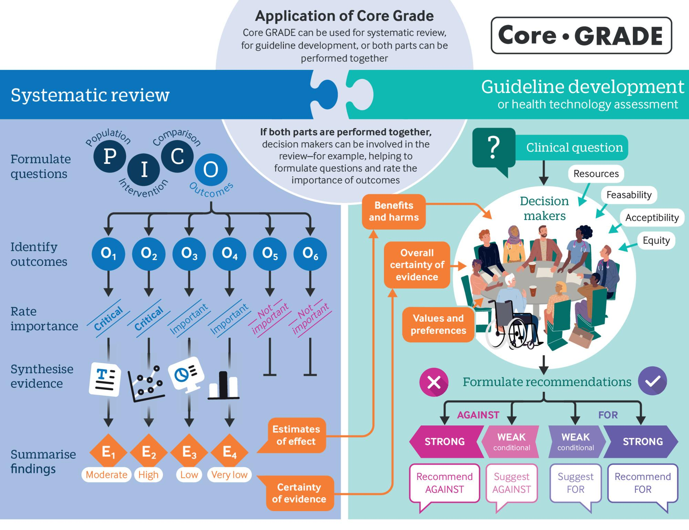

# 2 Overview of Core GRADE

## 2.1 Scope of Core GRADE

Core GRADE applies to the design, conduct, and analysis of systematic reviews as well as to use of their results in moving from evidence to decisions in clinical practice guidelines or health technology assessments. In the context of both reviews and guidelines, Core GRADE focuses on evidence comparing a single intervention with a single comparator. In the context of clinical practice guidelines, Core GRADE takes, primarily, an individual patient perspective. Nevertheless, the underlying principles also apply to a population or public health perspective that Core GRADE users may, in the context of clinical practice guidelines, consider as a secondary perspective. A glossary provides plain language definitions of key [GRADE terms](https://cdn.jsdelivr.net/gh/liamyao0713/core-grade-gitbook@main/assets/appendix/1.Glossary%20of%20GRADE%20terms.pdf).

## 2.2 The Core GRADE Process, Systematic Reviews and Evidence to Recommendations

Fig 2-1: Schematic overview of Core GRADE (Grading of Recommendations Assessment,Development and Evaluation) approach

Fig 2-1 depicts each of the key steps in using Core GRADE to create clinical practice guidelines or health technology assessment (HTA)reports: summarising the evidence, rating its certainty, and moving from evidence to recommendations. In Fig 2-1, the left panel addresses the systematic review process, including the definition of the review question formulated using the Patient/Intervention/Comparator/Outcome (PICO) format. The process includes specification of the relative importance of each of the outcomes, followed by the collation and summarization of the evidence, including ratings of certainty (quality) of the evidence for each outcome. The right panel depicts the decision-making process involved in the development of clinical practice guidelines and HTA reports. That process involves a guideline panel or decision-making group that considers key issues of magnitude of benefit, harms and burdens, certainty of evidence, and patient or public values and preferences. Decision makers might also consider resources, feasibility, acceptability, and equity in coming to recommendations either for or against an intervention and further specifying recommendations as strong or conditional (weak). When considering a population or public health perspective, they will almost always consider issues of resources, feasibility, acceptability, and equity.

When we refer to recommendations, we mean not only the highly structured guidance GRADE suggests for clinical practice guidelines but also the less formally structured guidance that HTA reports typically provide for their target decision makers. Although we focus our discussion on the structure of the guideline development process, it is also relevant to HTA and, excepting the process of moving from evidence to recommendations, to systematic reviews.

We will now present in detail the first steps in applying GRADE that involve planning the systematic review. These involve specifying the PICO, the formulation of the question, rating the importance of the outcomes, considering the possibility of subgroup effects, and considering the possible need for indirect evidence.
