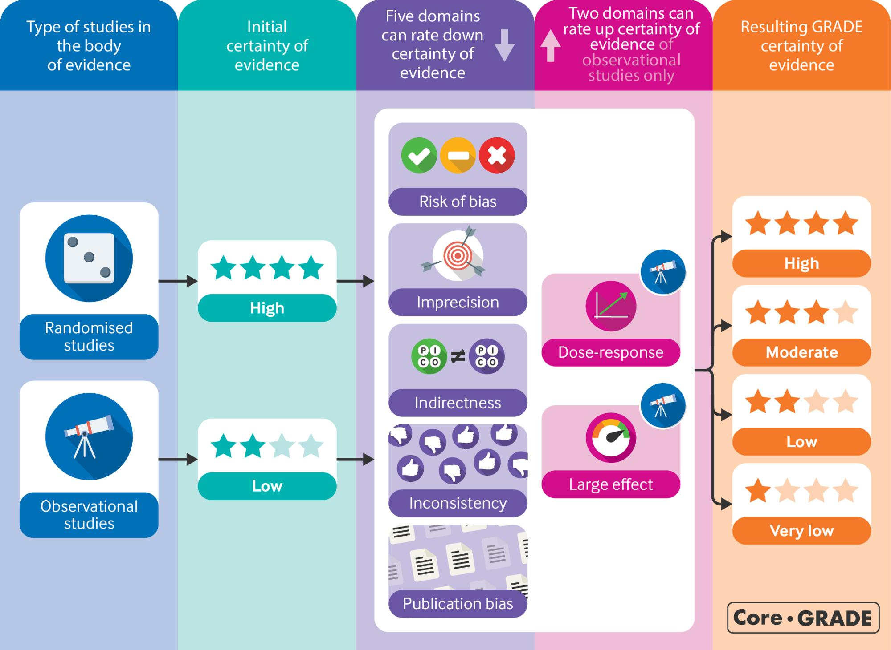
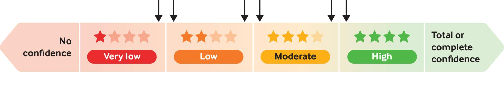
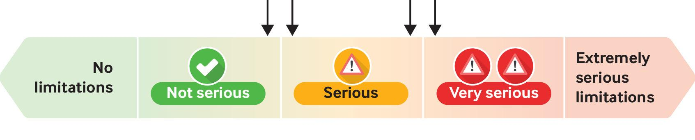
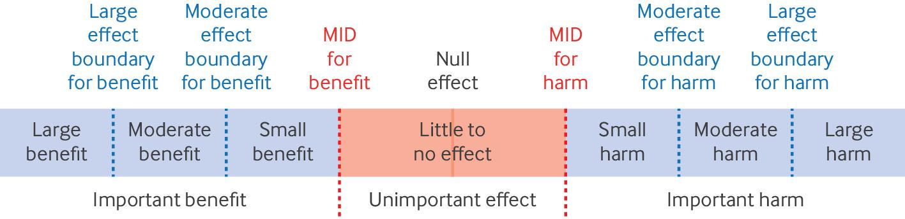
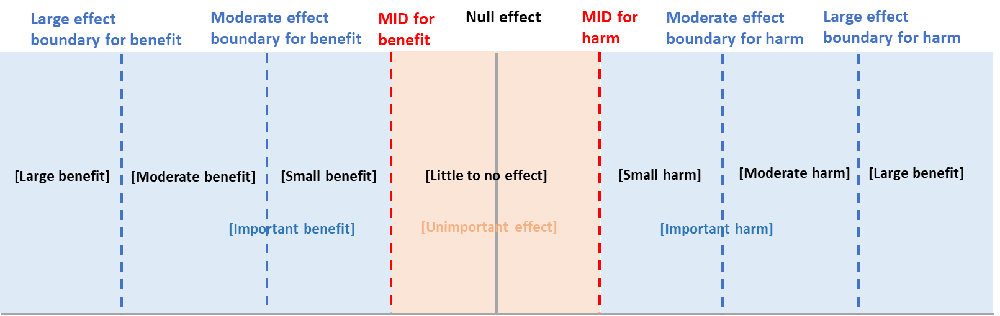
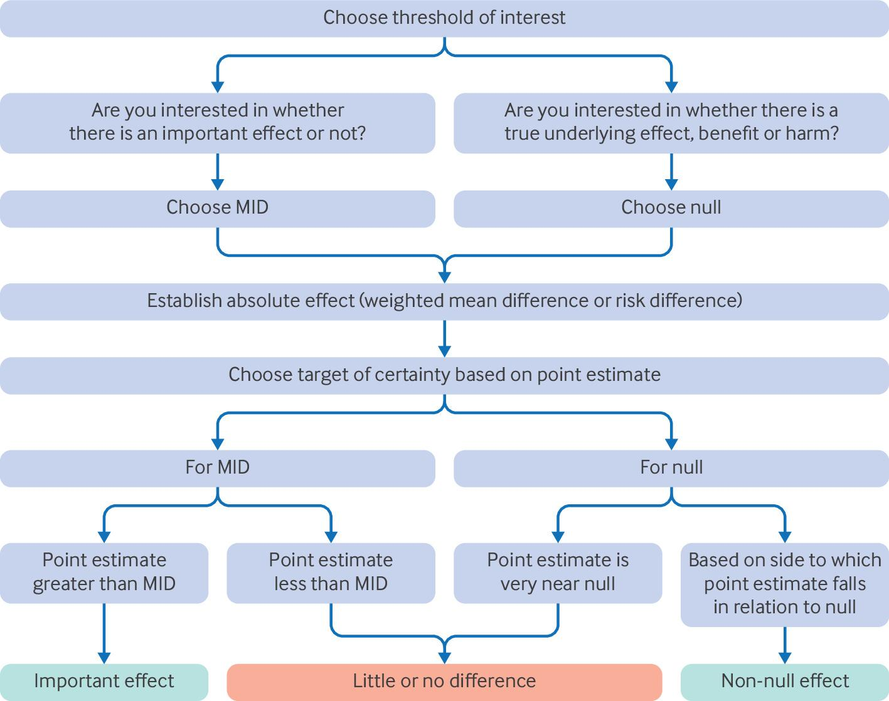
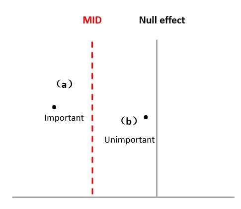

# 4 The First Step in Assessing Certainty: Choosing a Target of Certainty Rating

GRADE's certainty rating represents confidence that the true effect lies on one side of a chosen threshold (such as an important difference) or in a particular range (such as a small effect). GRADE offers a four-category system of rating certainty as high, moderate, low, and very low. Although GRADE certainty ratings rely on evaluation of individual studies, they refer to the entire body of evidence addressing a particular outcome rather than those individual studies.

 Fig 4-1: GRADE approach to rating certainty of evidence in intervention effects

Fig 4-1 summarises the GRADE approach to rating certainty of evidence for intervention effects. If the evidence comes from randomised controlled trials, Core GRADE ratings begin as high certainty. In contrast, a body of evidence from non-randomised studies of interventions (eg, cohort and case-control studies) begins as low certainty. Certainty in the evidence from both randomised controlled trials and non-randomised studies decreases when limitations are identified in any one of five domains: imprecision, inconsistency, risk of bias, indirectness, and publication bias. Core GRADE users can rate up certainty in non-randomised studies (but not randomised controlled trials) for large effects and for evidence of a dose-response gradient.

Previous GRADE guidance that included the possibility of rating up as a result of predictable direction of plausible confounding has proved too difficult to apply and too rarely applicable to be part of Core GRADE. We characterise limitations in each of these domains involved in rating down certainty as not serious; serious; very serious; or, rarely, extremely serious. The loss of certainty will result in rating down once for a particular domain (for example, from high to moderate certainty) if concerns are serious, and twice for a domain (for example, from high to low) if concerns are very serious.

Although GRADE has divided certainty of evidence into four categories, certainty is actually a continuum. As a result, one may, when rating is near a cut-off point between categories, have disagreements about certainty when judgments are in fact similar (fig 3).

 Fig 4-2: Certainty of evidence is a continuum that GRADE divides into four categories. Making judgments about rating down certainty when near a cut-off point (arrows) can lead to differences in judgments when certainty is similar

In terms of ratings near a cut-off point, the same phenomenon can occur when deciding whether to rate down in any one domain. Ratings may be near the cut-off point between no serious and serious concerns (potentially mandating rating down one level) or between serious and very serious (potentially rating down two levels) (fig 4).

 Fig 4-3: Each factor for rating down or rating up certainty of evidence in GRADE reflects a continuum. Arrows represent choices near the cut-off points and thus represent apparent disagreement but true agreement

To illustrate the potential problem, consider the following scenario. While summarising certainty of evidence for randomised controlled trials, the rating is near the threshold between no serious and serious limitations for three domains, with no problems in the other two domains. Erring on the side of not rating down, one might not rate down for any of the three and emerge with high certainty evidence. Erring on the side of rating down, one might rate down for all three and emerge with very low certainty evidence.

In this situation, one might consider the magnitude of the problems in the three domains, conclude that the certainty of evidence is near the threshold between moderate and low certainty, and ultimately decide to either rate down once and conclude moderate certainty evidence or rate down twice and conclude low certainty evidence. Such a situation illustrates the necessity for, after considering each of the individual domains, stepping back and taking an overall view of the threats to certainty of evidence.

For example, in the WHO’s living guideline for [covid-19 therapeutics](https://iris.who.int/handle/10665/365584) recommendation addressing lopinavir-ritonavir versus standard care for mortality and mechanical ventilation, the review team identified problems with both inconsistency and imprecision for mortality and mechanical ventilation outcomes. In both cases, however, the problems were near the threshold between not serious and serious (Fig 4-3) and thus were not so serious as to warrant rating down for both domains, with consequent low certainty of evidence (ie, rating down from high to low).

Thus, the decisions for mortality and mechanical ventilation was that the evidence was of moderate certainty. The panel noted that concerns in both inconsistency and imprecision domains led to the rating down from high to moderate certainty evidence. These thoughtful judgments reflect the strength of Core GRADE: the facilitation of a careful deliberative assessment of evidence within a sound, carefully considered, transparent structure that allows for flexibility.

## 4.1 Overview of the process of choosing a target and possible thresholds

When assessing the effect of an intervention, the primary interest is whether it outperforms alternatives such as standard care or other existing treatments. If no difference exists in benefit outcomes, a guideline panel will unlikely recommend and clinicians will unlikely use the new treatment unless it offers other advantages, such as reduced harms or burdens. Moreover, merely identifying the presence of an effect is often insufficient to recommend a treatment: patients and clinicians need to know whether the effect is large enough to be important. The question of whether there is an effect compared with the alternative corresponds to using the threshold of null effect, whereas the question of whether the effect is important aligns with using the minimal important difference (MID). The MID, a crucial concept in clinical studies and Core GRADE methodology, represents the smallest change in a single outcome that patients perceive as important.

The focus of Core GRADE is on these two questions: whether there is an effect compared with the alternative (ie, using the null as a threshold) and whether the effect is large enough to be important for patients (ie, using the MID as a threshold) (Fig 4-4). Use of additional thresholds of moderate and large effects has proved challenging for GRADE users and in our judgment does not provide important incremental value in making sound and optimally useful ratings of certainty. Nevertheless, those who wish to go beyond Core GRADE may wish to consider judgments of small, moderate, and large effects ([imprecision rating for ranges of effects](assets/appendix/4.Beyond%20Core%20GRADE-%20First%20step%20in%20assessing%20certainty-%20Imprecision%20rating%20for%20ranges%20of%20effect%20.pdf)).

 Fig 4-4: Thresholds and ranges for rating certainty of evidence in Core GRADE. Besides the Core GRADE thresholdsof null effect and M1D,two other thresholds may be considered-the moderate effect threshold that demarcatessmall versus moderate effects, and the large effect threshold that demarcates moderate versus large effects.GRADE=Grading of Recommendations Assessment, Development and Evaluation; MID-minimal important difference.  Fig 4-5: Thresholds and ranges for rating certainty of evidence in Core GRADE. Besides the Core GRADE thresholds of null effect and MID, reviewers may consider two other thresholds —the moderate effect threshold that demarcates small versus moderate effects, and the large effect threshold that demarcates moderate versus large effects.

Deciding what it is in which we are rating our certainty requires (ie deciding on the target of the certainty rating) involves three steps. For the first step, GRADE users decide if they are interested in whether an effect is or is not important, or whether a true underlying effect compared with the alternative exists.

 Fig 4-6: GRADE steps for deciding target of certainty rating.

For the next step, GRADE users establish the effect estimates through meta-analysis. An important choice they face is whether to use fixed effect or random effect statistical models in their analysis. Follow this [link](assets/appendix/6.First%20step%20in%20certainty%20assessment-%20Choosing%20between%20random%20effects%20and%20fixed%20effect%20models.pdf) If you wish to understand key issues review authors must consider when they choose between these approaches. In rating certainty of evidence, GRADE users typically consider absolute rather than relative effects. For binary outcomes, they obtain the best estimate of the risk difference and its 95% CI by applying the relative risk to an estimate of the baseline risk (Calculatiing absolute effects applying relative effects to baseline risk). [Appendix 6](assets/appendix/6.First%20step%20in%20certainty%20assessment-%20Choosing%20between%20random%20effects%20and%20fixed%20effect%20models.pdf) Later, in a section focusing on summary of findings tables, we present additional information about absolute effects and how to present continuous outcomes. Finally, GRADE users assess the magnitude of the absolute effect estimate in relation to the chosen threshold. We discuss the process for these steps, illustrated in Fig 4-6, further below.

## 4.2 Assessing if the effect is or is not important (MID as threshold)

When considering whether an effect is important, GRADE users must focus on absolute (ie, risk differences) rather than relative effects. The reason is, as we explained previously, it is absolute rather than relative effects that are important to patients—a 50% relative risk reduction (risk ratio of 0.5) could represent a 1% absolute reduction (from a baseline risk of 2% in control group to 1% in intervention group) or a much larger 20% absolute reduction (from 40% to 20%). If GRADE users are interested in whether an effect is important, they will thus need to make a value judgment about the importance of the outcome and, in particular, the threshold that delineates an important from an unimportant effect (ie, the MID).

The values and preferences that drive this choice should be those of the patients or other target populations, such as the general public. Guideline development and HTA require judgments about how people value the benefits, harms, and burdens of the interventions under consideration. Specifying MIDs, using either established MIDs (most likely to be available for patient reported outcomes such as pain, functional status, or quality of life) or their own estimates (generated from, for example, existing literature or their clinical experience) has proved helpful in facilitating the trade-offs between desirable and undesirable consequences of interventions.

Later, we address in some detail the issues of choosing MIDs for key outcomes. If GRADE users have chosen the MID threshold, and the point estimate from the meta-analysis represents an effect greater than the MID ((a) in 47), systematic review authors will rate their certainty that the true effect is an important benefit (or, if favouring the comparator, an important harm). If the point estimate represents an effect less than the MID ((b) in Fig 4-6), they will rate their certainty in an unimportant (little to no) effect.3

## 4.3 Assessing whether a true underlying treatment effect exists (null as threshold)

For several reasons, the null represents a potentially attractive alternative threshold to the MID in systematic reviews. Evidence on the distribution of values and preferences in the population population of interest is typically limited, making inferences about the MID challenging. Furthermore, systematic review authors may not see their mandate as including the search and interpretation of relevant evidence about MIDs. Finally, systematic review authors may want to leave the value judgments involved in choosing specific MIDs to HTA and guideline practitioners who typically consult a wider group of individuals, and often in a structured way.Indeed, in current practice systematic review authors using GRADE choose the null and MID thresholds with equal frequency.

If GRADE users have chosen the null they will, based on where the point estimate falls in relation to the null, typically rate certainty that a true beneficial or a harmful effect exists. If, however, the point estimate is near the null, because the intuitive inference in such situations is that the true effect represents little to no difference between intervention and control, they will rate their certainty in an unimportant effect ((b) in Fig 4-7). So, although choosing the null usually avoids specifying MIDs, it will not always do so. [Appendix 7 issue](<assets/appendix/7.Rating down (or not) for imprecision. Challenges and possible solution when one targets the null and the point estimate turns out to be very close to the null.pdf>). The difficulty in altogether escaping considerations of importance when choosing the null as a threshold may – or may not, current systematic review GRADE users choose the null and the MID more or less equally - lead GRADE users to prefer the MID as a threshold.

 Fig 4-7: Assessing if an effect is or is not important. As point estimate (a) is above the MID, the target of the certainty rating is that the true effect is important. As point estimate (b) is below the MID, the target of the certainty rating is that the true effect is unimportant (little or no difference).
