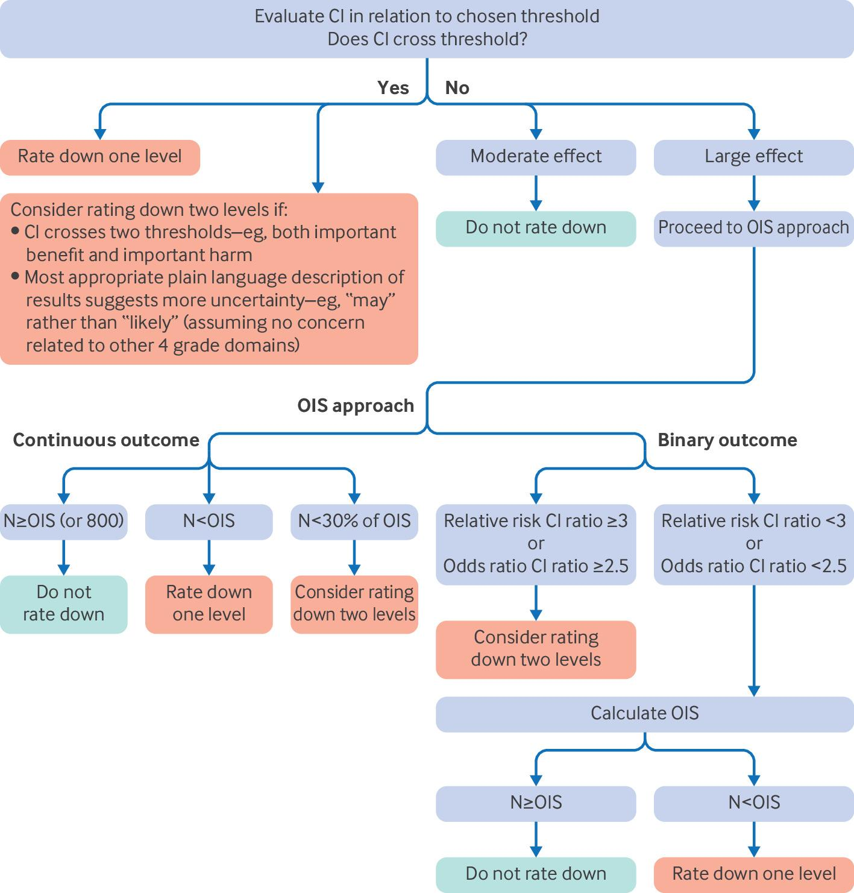
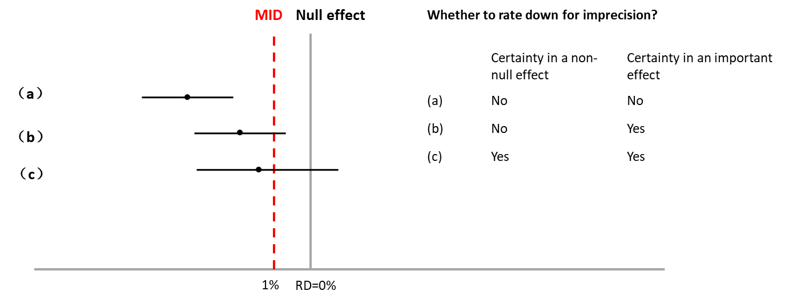
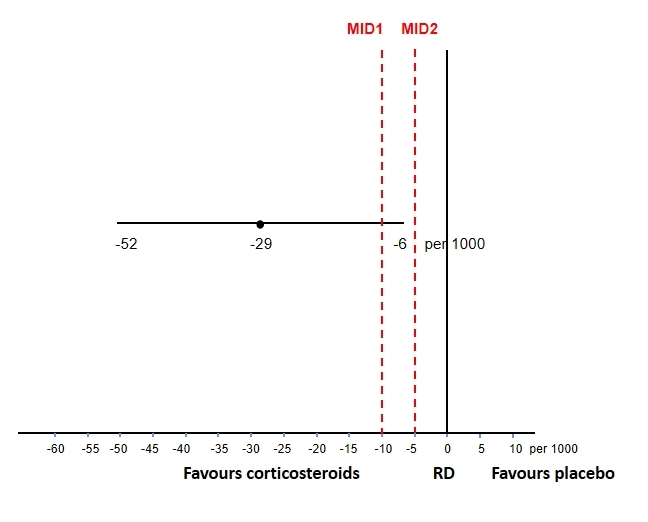
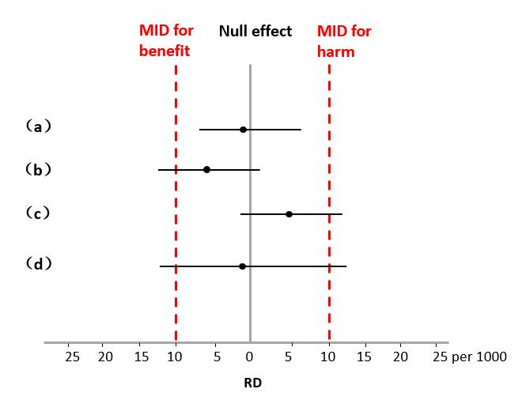
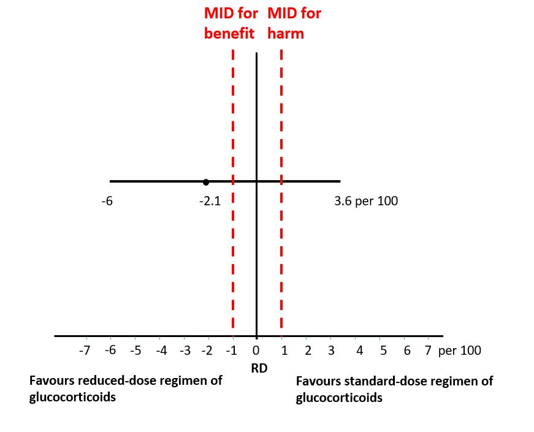

# 5 Rating certainty of evidence: imprecision

After deciding on the target of certainty rating, GRADE users assess whether limitations exist in any one of five GRADE domains (imprecision, inconsistency, risk of bias, indirectness, and publication bias). The following discussion addresses how GRADE users can make judgments about imprecision.

## 5.1 Imprecision defined

Studies of interventions seek to estimate the true underlying treatment effect. A meta-analysis provides our best estimate of the effect (the point estimate), and the CIs provide the bounds within which the true effect plausibly lies. The most commonly used CI is the 95% CI. The CI's width provides key information about the extent of imprecision, thus informing the impact of random error on certainty of evidence.

Fig 4-8: Core GRADE steps for rating imprecision. The relative risk CI ratio represents the upper boundary divided by lower boundary of CI of relative risk. CI=confidence interval; OIS=optimal information size

We will now describe our approach to making the judgment of whether the CI is sufficiently wide that GRADE users should rate down for imprecision, and whether they should rate down by one or two levels. Fig 4-8 presents the steps GRADE users take in making judgments regarding rating down for imprecision.

## 5.2 Rating down (or not) for imprecision

When deciding whether to rate down certainty for imprecision, GRADE users will consider whether the CI crosses the chosen threshold. For instance, consider the pooled effect estimate from a hypothetical systematic review of randomised controlled trials illustrated in Fig 4-9. For (a) in Fig 4-9, whether GRADE users are rating certainty for a non-null effect (null being a risk difference of 0%) or an important effect (the MID threshold of 1%), the CI does not cross either threshold and they will not rate down their certainty for imprecision. Assuming they have no concerns about the other four GRADE domains, they will have high certainty of a non-null effect as well as an important effect. For (b) in Fig 4-9, decisions about rating down certainty will differ depending on the threshold. When using the null, as the CI does not cross the threshold, GRADE users will not rate down their certainty for imprecision. When using the MID, as the CI crosses the threshold, they will rate down for imprecision. For (c) in Fig 4-9, whether GRADE users are rating their certainty in relation to the null or the MID, the CI crosses the threshold and they will rate down for imprecision.

Fig 4-9: Example of how the target of certainty rating using Core GRADE (above the MID or above the null) affects the rating of imprecision. (a) Core GRADE users will not rate down for imprecision in either case. (b) If the target of certainty rating is an important effect (above the MID), Core GRADE users will rate down for imprecision, but they will not if the target of certainty rating is an effect above the null. (c) GRADE users will rate down for imprecision in both cases.

Consider a systematic review of corticosteroids versus no corticosteroids for patients with community acquired pneumonia ([Fig 4-10](https://pubmed.ncbi.nlm.nih.gov/29236286/)). The meta-analysis of randomised controlled trials reported that corticosteroids yielded 29 fewer deaths per 1000 patients, with a CI from 52 fewer to 6 fewer. If review authors have chosen the null as their threshold, they will rate their certainty that a true mortality reduction exists and will not rate down for imprecision.

If review authors have chosen the MID as their threshold and set the MID at a difference of 10 deaths per 1000 patients (MID1 in Fig 4-10), because the point estimate is greater than the threshold, they will rate down their certainty in an important mortality reduction. Had they chosen an MID of 5 deaths per 1000 patients (MID2 in Fig 4-10), they would not rate down for imprecision because the CI does not cross the MID threshold.

Fig 4-10: An example of how rating down for imprecision in GRADE depends on the choice of MID in a systematic review of corticosteroids versus no corticosteroids on mortality in patients with community acquired pneumonia. If the review authors set the MID at MID1, they will rate down for imprecision, and if they set the MID at MID2, they will not rate down for imprecision. MID=minimal important difference

When GRADE users have chosen the MID as their threshold and the point estimate is less than the MID, they will rate their certainty that the true treatment effect is unimportant (ie, little to no effect) (all point estimates in Fig 4-11). As described in the section on assessing whether there is a true underlying treatment effect, when GRADE users have chosen the null as the threshold and the point estimate clearly suggests an unimportant effect (ie, the point estimate is close to the null) they will instead rate certainty in little to no effect by relating the CI to the [MID](https://cdn.jsdelivr.net/gh/liamyao0713/core-grade-gitbook@main/assets/appendix/7.Rating%20down%20\(or%20not\)%20for%20imprecision.%20Challenges%20and%20possible%20solution%20when%20one%20targets%20the%20null%20and%20the%20point%20estimate%20turns%20out%20to%20be%20very%20close%20to%20the%20null.pdf). In either case, they will not rate down for imprecision if the CI crosses neither threshold ((a) in Fig 4-11). If the CI crosses one threshold ((b) in Fig 4-11) or both thresholds ((c) in Fig 4-11) they will rate down for imprecision.

Fig 4-11: Rating certainty in little to no effect and rating down for imprecision in GRADE when the confidence interval crosses the MID.

## 5.3 Rating down once or twice for imprecision

As the CI gets wider, GRADE users will become progressively more uncertain about whether the truth is consistent with an important or unimportant effect, or whether it reflects a non-null effect. To reflect the degree of uncertainty influenced by imprecision of evidence, GRADE users can consider rating down one or two levels for imprecision. A role for plain language statements in making decisions Stating results in plain language that both clinicians and patients will easily understand is important in making GRADE optimally useful for clinical practice. GRADE has therefore provided guidance in making such statements (Table 4-1). We will return to these statements in the sixth paper in this series, in which we discuss GRADE summary of findings tables; we introduce them here because they can help decide on rating down once or twice for imprecision.

| Certainty    | Plain language summary                                                 | Null effect as threshold                                    | MID as threshold                                                                                   |
| ------------ | ---------------------------------------------------------------------- | ----------------------------------------------------------- | -------------------------------------------------------------------------------------------------- |
| **High**     | Treatment has a benefit, or Treatment improves outcome X               | Treatment has a benefit                                     | Treatment has an important benefit, or Treatment has little to no benefit                          |
| **Moderate** | Treatment likely has a benefit, or Treatment likely improves outcome X | Treatment likely has a benefit                              | Treatment likely has an important benefit, or Treatment likely has little to no benefit            |
| **Low**      | Treatment may have a benefit, or Treatment may improve outcome X       | Treatment may have a benefit                                | Treatment may have an important benefit, or Treatment may have little to no benefit                |
| **Very low** | We are very uncertain about whether treatment has a benefit            | We are very uncertain about whether treatment has a benefit | We are very uncertain about whether treatment has an important benefit or has little to no benefit |

Table 4-1: GRADE plain language statements when using the null effect or MID thresholds

The plain language summary pertains to both beneficial and harmful outcomes. Benefit was chosen here for illustration. GRADE=Grading of Recommendations Assessment, Development and Evaluation; MID=minimal important difference.

## 5.4 Rating down once or twice for imprecision: general principles

When deciding whether to rate down twice, two things are worth considering. The first is whether the CI crosses more than one threshold (eg, includes both important benefit and important harm). The second, considering GRADE’s plain language, is whether the most appropriate message that a particular effect likely exists or that it may exist.

Consider a systematic review comparing reduced versus standard dose corticosteroids for patients with [vasculitis](https://pmc.ncbi.nlm.nih.gov/articles/PMC8883216/?utm_source=chatgpt.com). For the outcome of mortality, the authors report a reduction in deaths of 21 per 1000 and a 95% CI that includes a 60 per 1000 reduction but also a 36 per 1000 increase (Fig 4-12). If the authors used an MID of 1% they would rate their certainty in an important effect. Given that the CI crosses the MID threshold they would rate down for imprecision.

Fig 4-12: An example of using GRADE to rate down two levels for imprecision in a systematic review of different doses of corticosteroids on mortality in patients with vasculitis. Since the confidence interval includes both important benefit and important harm, the review authors should consider rating down two levels for imprecision

Moreover, the width of this CI would prompt the review team to consider rating down twice for imprecision. Indeed, because the CI not only crosses the MID for benefit but also includes an important harm, they would rate down twice for imprecision. Thus, even before considering any other reason for rating down, the authors have only low certainty evidence that the lower dose regimen results in an important reduction in mortality (the target of their certainty rating).

The second consideration that bears on the decision about rating down once or twice has to do with the most suitable plain language statement that accompanies the certainty of evidence. Consider the example of corticosteroids for patients with vasculitis that includes a CI ranging from a 6% reduction to a 3.6% increase. Assuming systematic review authors do not have concerns on the other GRADE domains, would it convey the optimal message about certainty stating that the lower dose regimen likely results in an important reduction in mortality (the statement that would accompany rating down once) or that it may result in an important reduction in mortality (the statement that would accompany rating down twice). If the review authors considered the latter statement more appropriate (as in our view they should) they would rate down twice for imprecision. This highlights that it can be useful for GRADE users to consider what would be the most appropriate statement to communicate to their target audience.

The two considerations also apply to imprecision judgments when GRADE users choose the null as the threshold of interest. For example, consider a situation in which users rate their certainty in a benefit (threshold the null) but the CI also includes clearly important harm. The finding that the CI is consistent with both benefit and important harm motivates a plain language summary stating that the intervention “may” result in a benefit, and rating down two levels for imprecision.

## 5.5 Rating down for imprecision when effects are large and sample size limited

When the CI crosses the threshold or thresholds of interest, GRADE users will rate down for imprecision and do not need to consider sample size. If the CI does not cross the threshold, however, and the effect is large, they must be aware that large effects are unusual in interventions tested in randomised controlled trials. Attempts to replicate results of early studies suggesting such effects often fail. Thus, we suggest that when the CI does not cross the threshold or thresholds of interest and effects on binary outcomes are implausibly large (certainly relative risk reduction >40%, possibly >30%), GRADE users should consider rating down for imprecision if the sample size and number of events across all contributing studies are limited.

Our criteria for “limited” rely on routine sample size calculations that would be undertaken when planning a single randomised controlled trial (Assessing imprecision in the presence of a large effect) ([Appendix 8](https://cdn.jsdelivr.net/gh/liamyao0713/core-grade-gitbook@main/assets/appendix/8.Rating%20down%20for%20imprecision%20when%20effects%20are%20large-%20Assessing%20imprecision%20in%20the%20context%20of%20a%20large%20effect%20.pdf)). For binary outcomes, these involve specifying the acceptable error rates: α (typically 0.05) and β (typically 0.20), the control group event rate (chosen from the context), and a modest relative risk reduction, typically 20% or 25%. We call the sample size that emerges from the calculation the optimal information size (OIS).

If the total sample size of all the studies included in a meta-analysis exceeds the OIS, one does not rate down; if the total sample size proves less that the OIS, one rates down for imprecision. GRADE users can consult one of many online calculators to calculate a particular OIS. (eg, [https://www.openepi.com/SampleSize/SSCohort.htm).](https://www.openepi.com/SampleSize/SSCohort.htm\).) GRADE users can make the same calculation for continuous variables by specifying the smallest difference between intervention and control that one would want to avoid missing (ie, the MID) and using the standard deviation from one of the existing studies.

An alternative, a rule of thumb, would suggest that to not have concerns about imprecision (ie, to not rate down) would require 400 patients per group (total sample size 800). A previous GRADE article provides further details and examples of OIS exploration for both binary and continuous [variables](https://doi.org/10.1016/j.jclinepi.2011.01.012) (Assessing imprecision in the presence of a large effect).

## 5.6 Conclusion

The process of assessing the certainty of evidence requires choosing a threshold, either the null or the MID, and then choosing the target of certainty by noting the location of the point estimate in relation to the threshold. When the initial choice of threshold is the null, if the point estimate is close to this threshold, GRADE users rate certainty in little to no effect. For judging imprecision, if the CI does not cross the threshold, GRADE users typically do not rate down for imprecision; if it crosses the threshold, they do. GRADE users may rate down twice when the CI crosses more than one threshold, in particular when it crosses thresholds of important benefit and important harm. Finally, when the CI does not cross the threshold but the effect is large, Grade users invoke the OIS and rate down for imprecision if the total sample size fails to meet the OIS criterion.
