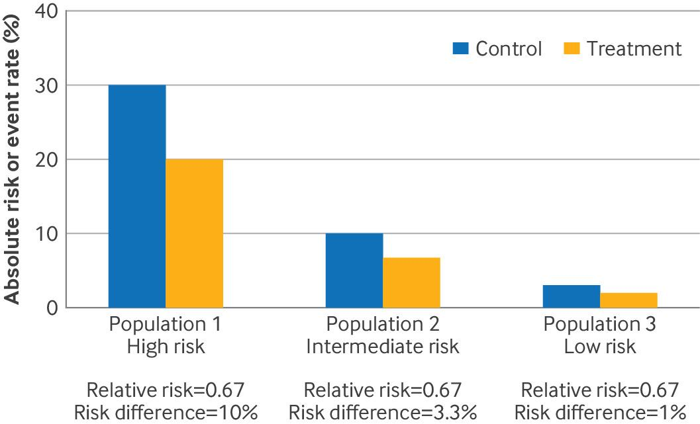
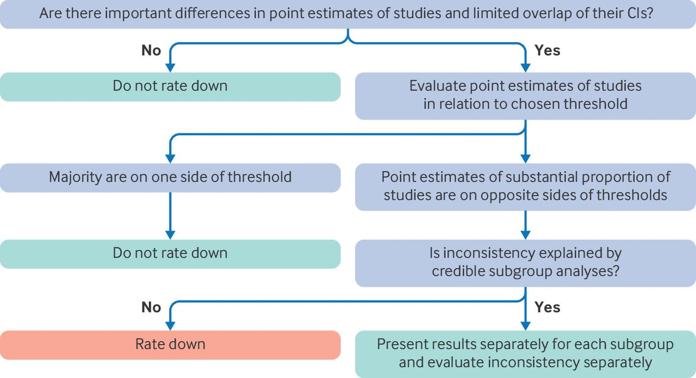
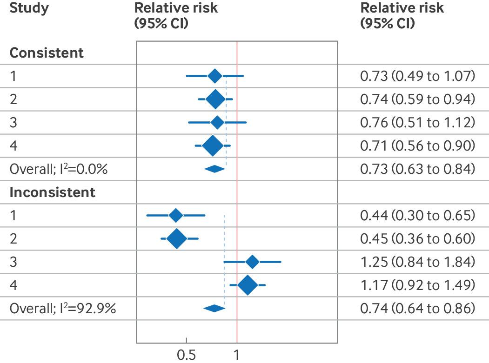
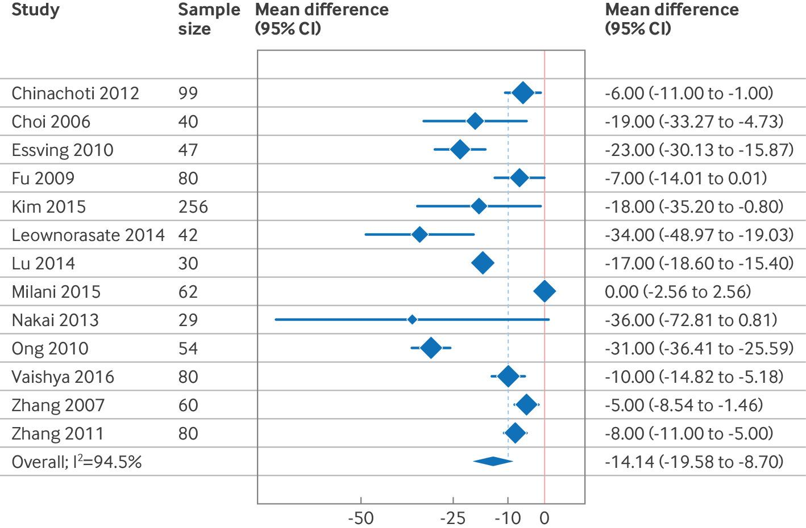

# 6. Rating certainty of evidence: Inconsistency

## 6.1 What do we mean by inconsistency?

By inconsistency we mean unexplained variability in results across studies. We are particularly concerned about inconsistency that is sufficiently great that, depending on which of the varying results represents the truth, inferences for clinical practice would differ. Authors writing about inconsistency sometimes use the term heterogeneity, particularly when referring to statistical tests related to inconsistency.

In addressing what we mean by inconsistency, because of how GRADE users sometimes get confused, we will clarify what we do NOT mean by inconsistency. Ratings of certainty pertain to bodies of evidence summarised in lys systematic reviews. The GRADE process begins with construction of a structured clinical question. Studies addressing a particular question are certain to vary in patients enrolled, aspects of the intervention and comparator chosen, and the way the outcome is measured, and such variability is often appreciable.&#x20;

GRADE users may intuit that such variability (ie, inconsistency in PICO elements) compromises the certainty of evidence from a systematic review. This, however, is rarely the case. Indeed, if effects are similar from study to study, variability in the PICO elements enhances the applicability of the pooled effect to a wider range of clinical contexts. If effects vary across studies, differences in the PICO elements provide an opportunity to explore the possible sources of the inconsistency in results. Thus, inconsistency in PICO elements is not what decreases confidence in the evidence, it is variability in results.

## 6.2 Choosing the right measure of effect when assessing inconsistency

#### Binary outcomes: variability in relative versus absolute effects

As we have previously pointed out, relative treatment effects seldom vary across patient subgroups such as old and young, male and female, or less sick and more sick. However, given that such patient characteristics are often associated with substantial differences in baseline risk (ie, probability of experiencing the outcome in the comparator group), even in the presence of constant relative treatment effects across such patient groups, the resulting absolute treatment effects will differ substantially. The hypothetical example in Fig 6-1 illustrates the situation. Here, the relative risk reduction is constant, at 33%, across low, medium and high risk groups. Because of the substantial differences in baseline risk, the risk difference between treated and untreated patients varies substantially, from 10% in high risk patients to 1% in low risk patients.

Fig 6-1: Constant relative risk with varying baseline risks, leading ot varying reduction in absolulute risks. In each population, the larger event rate represents the control (baseline risk, blue bars) and the smaller event rate the intervention (orange bars)

Despite risk differences being more important to patients than relative risks, authors of randomised trials and meta-analyses typically highlight relative rather than absolute effects. They do so because of the typical consistency in relative risks and the expected variability in risk differences (Fig 6-1). Greater consistency in results is desirable: it increases confidence in the pooled estimates of effect. Thus, the anticipated consistency of relative effects and variability of absolute effects is the reason why, in GRADE summary of findings tables, authors estimate risk differences in each relevant patient group by applying relative risks to baseline risks, and why guideline authors may offer different treatment recommendations for individuals at low, medium, and high risk. Finally, because inconsistency in absolute effects is ubiquitous and inconsistency in relative effects is rare, we are concerned with inconsistency in relative rather than absolute effects.

#### Continuous outcomes

Continuous outcomes are typically measured as absolute effects—thus, when considering inconsistency, looking at relative effects is typically not an option. For example, duration of illness, hospital length of stay, functional status, or quality of life are typically evaluated as mean differences. Inconsistency in mean differences across studies can lower certainty in evidence in the same way as inconsistency in relative effects does for binary outcomes.

## 6.3 Core GRADE's approach to preparing for inconsistency

In this section, we discuss how, when thinking ahead to possible inconsistency in results, GRADE users formulate a plan to best deal with the inconsistency they may ultimately find. When observing relative effects for binary outcomes and absolute effects for continuous outcomes across studies in a body of evidence, several reasons for inconsistency may exist. These include random error and differences in population, intervention, comparison, and outcome (PICO) elements. Hypotheses may be able to explain these differences—this is the hope when preparing for the possibility of large inconsistency—or they may not. If they do explain inconsistency, GRADE users will provide separate evidence summaries for each subgroup and make judgments about inconsistency within each subgroup. If the hypotheses do not explain differences, the unexplained variability in effects decreases the certainty of evidence.

## 6.4 Three options for possible subgroups with different intervention effects

When reflecting on the possibility that effects differ across patient subgroups (eg, effects may differ in old versus young people) or across interventions subgroups (eg, oral versus parenteral antibiotic treatment), review authors face a potential problem. Selecting a narrow range of subgroups in the PICO will always sacrifice applicability, and often precision. Selecting a broader range of patient and intervention subgroups will enhance generalisability and precision but runs the risk, if effects differ substantially, of pooling inappropriately across patient or interventions subgroups.

To solve the problem GRADE users must, for each subgroup, distinguish between three scenarios: one has no reason to suspect differences in effects across subgroups; one is confident that effects vary across subgroups; or one has good reason to suspect subgroup differences but is uncertain.

Take, for example, two different age groups: young and old. The following are the three scenarios and corresponding actions they would mandate:&#x20;

1. Previous research provides little support for the possibility that effects differ between old and young people. In this scenario, review authors would choose a broad age range for the PICO, and the findings would apply to both age groups.
2. Previous research has given reason to be confident that the relative effects on older versus younger people differ. Accordingly, one would choose a narrow age range for the PICO (eg, older people) or create two separate PICOs and sets of recommendations, one for older people and the other for younger people.
3. Previous research plausibly suggests that effects differ between old and young people, but one is uncertain. One would then choose a broad age range in the PICO and conduct subgroup analysis or meta-regression to explore the possible impact of differences in age.

Table 6-1: Summarises the three scenarios when considering subgroups during PICO construction, and provides examples of each.

<table><thead><tr><th>Scenario</th><th>Implications for PICO construction</th><th width="349.3125">Example</th></tr></thead><tbody><tr><td><strong>1.</strong> Previous research provides no compelling evidence that effects differ across patient or intervention subgroups (no subgroup hypothesis)</td><td>Combine all subgroups (single estimate of effect) without a subgroup hypothesis</td><td>The World Health Organization has generated several recommendations regarding the management of patients with covid-19. The guideline panels inferred that effects were very likely to be similar in men and women and thus in all their recommendations provided a single estimate for men and women</td></tr><tr><td><strong>2.</strong> Previous research suggests that effects differ across patient or intervention subgroups (subgroup effects are presumed to exist)</td><td>Narrow PICO to one subgroup, or construct two separate PICOs for each subgroup</td><td>A guideline panel addressing optimal transfusion thresholds in anaemic patients considered that the biology differed between children and adults and therefore looked at the evidence separately and provided separate recommendations</td></tr><tr><td><strong>3.</strong> Previous research plausibly suggests that effects differ across patient or intervention subgroups, but one is uncertain (directional subgroup hypothesis)</td><td>Initially combine all subgroups (single estimate of effect), but also provide and then test a directional subgroup hypothesis</td><td>A systematic review comparing immediate versus delayed antiretroviral therapy in patients with a concomitant diagnosis of HIV and tuberculosis tested whether the impact of early versus delayed treatment on mortality differed between those with higher and lower CD4 cell counts. A previous trial suggested that hypothesis, including a clear direction, but for another outcome</td></tr></tbody></table>

PICO=population, intervention, comparison, and outcome.

We recommend that to maximise precision and generalisability, review authors frame their PICOs broadly. In doing so, however, they must prepare themselves for the possibility of inconsistent results across studies. One way to prepare is to choose the third scenario when constructing the PICO. We now present details of how to deal with this third scenario.

## 6.5 Need for a priori hypotheses with a specified direction

Preparation for the possibility of inconsistency in results involves generating a small number of well chosen a priori hypotheses to explain that inconsistency. Subgroup effects exist when the effects of an intervention versus a comparator differ according to characteristics of patients (eg, older versus younger, more sick versus less sick) or differences in interventions (eg, longer versus shorter duration of therapy). Thus, authors may postulate subgroup effects according to different patient groups or interventions.

Reviewers should base their hypotheses on previous evidence (eg, from a related trial, meta-analysis, or cohort study) or thorough understanding of the underlying biology, and they should include the direction of the subgroup effect (hypothesising, for example, not just that effects may differ across patient ages, but also that effects will be larger in old people than in young people). Postulating more than a small number (ideally three or fewer) of directional hypotheses will increase the likelihood of chance findings (spurious associations), thus undermining the credibility of any subgroup effects.

For instance, in the systematic review of when to start antiretroviral therapy in patients with a concomitant diagnosis of tuberculosis and HIV, the authors made only a single a priori hypothesis in considering mortality. They postulated that effects may differ depending on CD4 T cell counts using a threshold of <0.050×109 cells/L v >0.050×109 cells/L. [Their hypothesis](https://pubmed.ncbi.nlm.nih.gov/26059627/) was based on previous evidence of a [higher incidence of adverse immune reactions in patients with a lower CD4 T cell count](https://pubmed.ncbi.nlm.nih.gov/26148280/).

One might reasonably presume the direction of the subgroup effect (early antiretroviral therapy is worse in those with lower CD4 T cell counts). In this case, as it turned out, and contrary to the hypothesis, the results suggested that if there was a benefit of early therapy it was more likely in those with a low CD4 T cell count (P=0.12 for interaction). The example thus highlights how the review authors prepared themselves for the possibility of inconsistent results through specifying a single, directed subgroup hypothesis based on related evidence. The example also highlights that, without a subgroup analysis, GRADE users should exercise caution before concluding that effects differ between subgroups.

The ability to predict the direction of a subgroup effect provides a useful criterion when deciding between the first scenario (broad PICO, no subgroup analysis) and third scenario (broad PICO and subgroup analysis). If one cannot confidently specify the direction of the potential subgroup effect, one should choose the first scenario rather than the third. Consistent with our recommendation of a small number of compelling subgroup hypotheses, we discourage post hoc exploration of possible subgroup effects. There may be situations, however, in which high (if unwarranted) interest from clinical audiences demands conduct of subgroup analyses. Investigators can then still specify a best guess direction, label analyses as exploratory, conclude low credibility whatever the results, and ultimately not count these analyses against the credibility of appropriately pre-specified hypotheses.

## 6.6 Criteria for judging serious inconsistency

Having addressed how Core GRADE users should plan for dealing with inconsistency in results, we ill now address how they will implement their plan (see Fig 6-2). In the three following sections we describe how GRADE users can determine whether inconsistency is of sufficient concern to consider rating down for inconsistency. If they do find important inconsistency, they should look to their a priori hypotheses to see if they can explain that inconsistency—a process that will include rating the credibility of any possible subgroup effects they identify. A subsequent section deals with this issue of subgroup explanations of variability in results. If only one eligible study exists, GRADE users will not rate down for inconsistency, although if the authors provide the data then they may still address the possibility of subgroup effects.

Fig 6-2: Flow chart summarizing GRADE’s approach to addressing inconsistency in results

## 6.7 Three visual criteria from forest plots

Consider the hypothetical body of evidence in Fig 6-3. When considering whether studies yield similar or different results, most observers of these forest plots will quickly conclude that results in the top half ofthe figure are consistent whereas results in the bottom half are inconsistent. Aspects of the results that justify these inferences are similarity versus differences in point estimates, the extent of overlap in confidence intervals (CIs), and the relation of point estimates to the threshold of certainty rating.

Fig 6-3: Forest plots of consistent and inconsistent results from four randomized trials with similar pooled estimates. The broken line represent the minimal important difference.

Point estimates—One is more inclined to consider rating down for inconsistency when point estimates differ substantially between studies. In figure 6-3, the point estimates in the top half of the figure are similar, ranging from 0.71 to 0.76. The similarity in the point estimates suggests no need to consider rating down for inconsistency. In contrast, in the bottom half of Fig 6-3, two studies suggest substantial treatment effects—relative risk reductions >50%—and two other studies suggest modest harms, 17% and 25% increases in relative risk. The large differences in the point estimates of the two pairs of studies suggest rating down for inconsistency.

Overlap of CIs—One is more inclined to rate down for inconsistency if the CIs of included studies do not show substantial overlap. In the top half of Fig 6-3, the CIs of the four studies are largely overlapping. This overlap suggests no need to consider rating down for inconsistency. In contrast, in the bottom half of Fig 6-3 the CIs between the first and second pairs of studies are completely non-overlapping. This provides a strong rationale for rating down for inconsistency.

Relation of point estimates to the threshold of certainty rating—Infrequently, GRADE users will find appreciable inconsistency using the first two criteria, but that point estimates largely lie on the same side of a chosen threshold (the null—ie, no difference between intervention and comparator) or the minimal important difference (MID)). In these situations, they will be less inclined to rate down for inconsistency.

Whichever threshold one uses, in the top half of Fig 6-3 all studies are on one side of the threshold (no need to consider rating down for inconsistency). In the bottom half of figure 6-3, the pairs of studies are on opposite sides of either threshold, with one pair showing benefit and the other showing harm, thus the need to consider rating down

While, as here, we may initially assess inconsistency using relative risks, GRADE users must establish MIDs only on absolute risks. In this hypothetical example, the authors have, considering the baseline risk of the outcome, established that a relative risk reduction of about 15% will translate into a minimally important absolute effect of 1%. [Appendix 9 process](https://cdn.jsdelivr.net/gh/liamyao0713/core-grade-gitbook@main/assets/appendix/9.Three%20visual%20criteria.%20Generating%20an%20MID%20relative%20risk%20threshold.pdf) (Generating an MID from a relative risk threshold).

## 6.8 Applying visual criteria: how choice of threshold affects judgments of inconsistency

The three key criteria for judging inconsistency— similarity of point estimates, overlapping of CIs, and relation of results to the chosen threshold for rating certainty—apply equally well to continuous outcomes. Consider Fig 6-4, which depicts the results of a meta-analysis evaluating the impact of local infiltration analgesia on postoperative pain in patients after total knee arthroplasty (adapted from a figure we used in a previous GRADE article to illustrate these criteria).

Consider the appropriate inference if authors of the systematic review of this evidence chose to rate their certainty with respect to the null. The pooled estimate clearly excludes the null, and the point estimates of all but one study support that inference. Thus, there is no reason to rate down for inconsistency.

However, consider if the review authors chose to rate their certainty with respect to the MID and selected a value of 10 mm. Now, five studies show values below the threshold and eight at or above the threshold. This inconsistency undermines the inference of an important effect suggested by the pooled estimate (14 mm) and would warrant rating down for inconsistency. Although this example highlights how GRADE users should attend to the relation of point estimates to the threshold of certainty rating, when point estimates differ substantially and CIs do not overlap, they will seldom find compelling reason to invoke this additional criterion.

Fig 6-4: Forest plot from a systematic review of the impact of local infiltration analgesia on postoperative tain after total knee arthroplasty. The broken line represents an estimate o the minimal important difference in pain score (10 mm visual analogue scale.

## 6.9 One criterion for statistical assessment

A statistical criterion, I2, describes the percentage of the variability in effect estimates that is due to heterogeneity rather than sampling error (chance), and may complement the three visual criteria. The lowest possible I2, 0%, tells us that chance easily explains the difference between studies—the conclusion in the top half of Fig 6-3. As I2 approaches the highest possible value, 100%, the likelihood that chance alone explains the variability observed becomes extremely small. This is true of the bottom half of Fig 6-3 in which I2 is 93%.

I2 may, however, prove misleading. In particular, if the included studies have narrow CIs the associated I2 may be misleadingly large. Moreover, if the point estimates are mostly on one side of the threshold of certainty rating, the high I2 will be irrelevant. For instance, in Fig 6-4 the high I2 value of 94.5% suggests enormous inconsistency. Nevertheless, when using the null as the target of certainty ratings, 12 of the 13 studies showed mean differences favouring the intervention and one would conclude no problematic inconsistency.

It is natural that review authors desire hard and fast rules for interpreting I2. The limitations of the statistic make such rules problematic. The best we can do is suggest that one will seldom see serious inconsistency with I2 values <30%, and as I2 rises beyond that value, the possible need to rate down certainty increases.

## 6.10 Apparent subgroup effects based on a priori hypotheses

#### The burden of proof lies with those claiming a subgroup effect

We have pointed out that relative effects overwhelmingly tend to be similar across subgroups, and testing a large number of subgroup hypotheses results in a high risk of spurious findings. In general, GRADE users should be sceptical about subgroup effects, and the burden of proof lies with those claiming such effects. Nevertheless, true subgroup effects do sometimes exist, and GRADE users require methods to identify such instances and distinguish them from spurious associations.

#### Criteria for judging the credibility of subgroup effects

For almost 50 years methodologists and statisticians have been writing about how to distinguish credible from spurious subgroup claims. In the following, we apply the key lessons from this inquiry to an example. In an exploration of subgroup effects, authors of a [systematic review postulated that randomised trials of blockers showing greater reductions in heart rate would show larger relative risk reductions in deaths among patients with heart failure ](https://pubmed.ncbi.nlm.nih.gov/19487713/)([Using ICEMAN to assess McAlister et. al. systematic review](https://cdn.jsdelivr.net/gh/liamyao0713/core-grade-gitbook@main/assets/appendix/10.Criteria%20for%20judging%20the%20credibility%20of%20subgroup%20effects-%20Using%20ICEMAN%20to%20assess%20McAlister%20.pdf)). The authors found an apparent effect modification: for every five beats per minute reduction in heart rate with blocker treatment, they found a commensurate 18% reduction in the risk of death. The question arises: is this a true or spurious subgroup effect?

In deciding on the credibility of subgroup effects, one issue in systematic reviews and meta-analyses is whether the effect modification was based on a comparison between studies (eg, blockers achieved different reductions in heart rate in different studies and this is the basis of the analysis) or a within study comparison (the same study included interventions with greater and lesser heart rate reduction, achieved, for example, by including groups with larger and smaller doses of blockers). Within study comparisons are far more compelling than between study comparisons. In this case, however, the analysis relies exclusively on between study comparisons, reducing the credibility of the apparent effect modification.

Perhaps the most important single issue in addressing a putative subgroup effect is whether chance can explain the difference in effect between subgroups. The lower the P value associated with the appropriate statistical test—referred to as a test of interaction—the less likely chance is an explanation and the more credible becomes the postulated effect. However, this statistical criterion can be severely undermined if authors have not prespecified subgroup analyses, have conducted a large number of subgroup analyses, or report only selected results. Violation of any of these criteria greatly increases the probability that chance rather than a true subgroup effect is responsible for apparent differences between groups, and thus renders the P value associated with the test of interaction far less trustworthy. In this case the authors specified the subgroup analysis in advance but tested 12 hypotheses with a P value of 0.006 for interaction

A team of methodologists has developed the first formal Instrument for assessing the Credibility of Effect Modification ANalyses ([ICEMAN](https://iceman.help/)). This instrument addresses all the issues we have discussed, along with several others, and is straightforward to apply failure ([Using ICEMAN to assess McAlister et. al. systematic review](https://cdn.jsdelivr.net/gh/liamyao0713/core-grade-gitbook@main/assets/appendix/10.Criteria%20for%20judging%20the%20credibility%20of%20subgroup%20effects-%20Using%20ICEMAN%20to%20assess%20McAlister%20.pdf)).

#### Addressing the results of the subgroup credibility exploration

If GRADE users conclude that the putative subgroup effect is of low or very low credibility, they will present results only for the summary of all studies, rating inconsistency for the entire population. However, a conclusion of moderate or high credibility warrants the creation of separate PICO questions for each subgroup, separate presentation of results for each subgroup, separate ratings of certainty considering all five domains of rating down, and separate conclusions in keeping with each estimate of effect.

A result near the threshold between low and moderate credibility presents challenges. One option is to present both the overall and the subgroup results in the summary of findings table. A second is to present only one of the overall and subgroup results in the summary of findings table and report, in the text, a briefer summary of the one not chosen for the summary of findings table. Whatever they choose, authors should acknowledge the close-call nature of the credibility assessment.In the example of blockers to reduce mortality in patients with heart failure, the conclusion regarding credibility falls in the range of moderate credibility. Because the effect modifier was a continuous variable, the authors chose, rather than an arbitrary threshold, the more powerful continuous meta-regression approach to the analysis. Their results thus suggest that the greater the effect in reducing heart rate, the greater the mortality reduction. The moderate credibility of the effect suggests possible results of shared decision making with patients and their clinicians: use doses of blockers that substantially but safely reduce the patients’ heart rate.

## 6.11 Conclusion

When GRADE users construct PICO frameworks that are broad with respect to both patients and interventions—as we believe they should—they must prepare for the possibility of inconsistent results. They do so by identifying a priori hypotheses to explain inconsistency, including a postulated direction.

Having decided on their subgroup hypotheses, GRADE users address the key criteria for evaluating inconsistency. Examining the forest plot, they note the magnitude of differences in point estimates, the extent to which the CIs overlap, and where the point estimates lie in relation to the target of their certainty rating. The greater the variability in point estimates and the less the overlap of CIs, the more likely there is problematic inconsistency. The decision, however, requires consideration of the chosen threshold for certainty rating: whether the null or the MID, the greater the extent to which, in the presence of minimally overlapping CIs, point estimates fall on opposite sides. Fig 6-2 summarizes this process.
