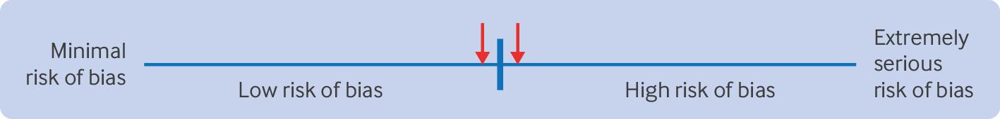
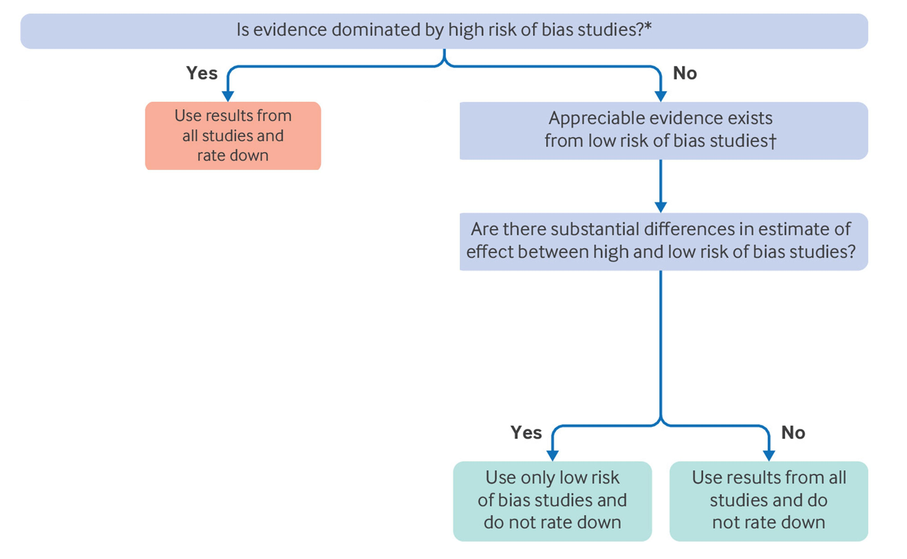

# 7 Rating Certainty of Evidence: Risk of Bias

## 7.1 What you will learn in this section

This section will help you understand how to assess risk of bias in individual studies and across bodies of evidence, recognize publication bias, and appropriately rate the certainty of evidence from non-randomized studies.

The information in this section will enable GRADE users to understand the definition of risk of bias, choose appropriate instruments for assessing risk of bias of individual studies, rate risk of bias across the body of evidence by considering the relative contribution of low and high risk of bias studies to the pooled estimate and the similarities or differences in their results, understand the causes of and approaches for detecting publication bias, and make appropriate judgments about when to rate up the certainty of evidence from non-randomized studies of interventions (NRSI, synonym observational studies).

Before starting, we have to begin with a warning and a suggestion. The systematic review community has become aware of the distressing frequency of studies that are completely untrustworthy because of inaccurate reporting of methods or outright fraud. Systematic review authors must therefore consider beginning with a check for such studies. A number of instruments are [available](https://www.medrxiv.org/content/10.1101/2025.09.03.25334905v1) [\[1\]](https://fairsharing.org/5510)[\[2\]](https://pubmed.ncbi.nlm.nih.gov/39136348/). For studies that fail this check and are likely, or highly likely. to be untrustworthy, reviewers should discard them altogether or include them only in a secondary sensitivity analysis.

## 7.2 What do we mean by risk of bias

We define bias as a systematic deviation from the underlying true effect of an intervention on an outcome of interest in a given population. Both randomised controlled trials and NRSI may be subject to limitations in design or execution that can bias the results. Well designed studies will institute safeguards, such as centralised randomisation and blinding, that minimise risk of bias,. To the extent studies do not implement these safeguards, risk of bias increases. If serious limitations exist among the studies dominating the pooled estimate of effect, Core GRADE users will typically rate down the overall certainty of evidence for risk of bias.

Issues of risk of bias, and thus safeguards against bias, differ between randomised controlled trials and NRSI. We will first deal with randomised controlled trials and then NRSI. The subsequent discussion will address how GRADE users should look across the body of evidence to decide whether or not to rate down for risk of bias.

## 7.3 Risk of bias in individual studies: Randomized trials

Box 1 summarises the risk of bias items that randomised controlled trial risk of bias instruments appropriately identify and that GRADE users may want to consider.

### Box 1: Risk of bias in randomised trials

**Most commonly included and important items across various randomised controlled trial risk of bias tools**

* Inadequate generation of random allocation sequence
* Inadequate concealment of allocation
* Not blinding participants
* Not blinding healthcare providers
* Not blinding data collectors
* Not blinding outcome assessors
* Not blinding data analysts
* Missing outcome data

**Less important items variably captured across randomised controlled trial risk of bias tools**

* Imbalance in co-interventions between groups
* Difference in outcome assessment or data collection between groups
* Difference in follow-up time, frequency, or intensity of outcome assessment between groups
* Deviation from intention-to-treat analysis
* Selective outcome reporting
* Early termination for benefit

Although review authors can choose from one of many instruments that address risk of bias in parallel group randomised controlled [trials](https://pubmed.ncbi.nlm.nih.gov/36424692/), two rigorously developed instruments that address limitations of their predecessors merit particular attention. One, Cochrane's tool for assessing risk of bias in randomised trials, RoB 2, is methodologically sophisticated but has limitations of complexity and difficulty in application. Its sophisticated algorithms and the new terminologies it introduced may contribute to these limitations. Studies have reported low interrater reliability of RoB 2 and challenges in implementation. RoB 2 nevertheless includes features that may appeal to those who want to go beyond Core GRADE.

In contrast, ROBUST-RCT was inspired by the same motivation as Core GRADE: to achieve maximal simplicity without sacrificing methodological [rigour](assets/appendix/22.Beyond%20Core%20GRADE.%20Risk%20of%20bias%20in%20individual%20studies-%20Randomised%20trials-%20Alternative%20approach%20to%20addressing%20missing%20outcome%20data%20.pdf). Strengths of the new instrument include preparatory systematic surveys of existing instruments and of meta-epidemiological studies of risk of bias, and extensive pre-testing with both junior and experienced systematic reviewers.

ROBUST-RCT includes six core items addressing random sequence generation, allocation concealment, blinding of participants, blinding of healthcare providers, blinding of outcome assessors, and missing outcome data, as well as eight optional items. The instrument provides two approaches to addressing missing outcome data. Those who want to go beyond Core GRADE may consider a more sophisticated approach that is beyond Core GRADE [11](assets/appendix/11.Beyond%20Core%20GRADE.%20Rating%20risk%20of%20bias%20across%20bodies%20of%20evidence-%20When%20evidence%20dominated%20by%20high%20risk%20of%20bias%20studies,%20Considering%20direction%20of%20bias.pdf) that involves looking across results from all studies (Aleternative approach to assessing missing outcome data).

Failure to ensure methodological safeguards may not lead to risk of bias (eg, blinding of participants is irrelevant in a trial enrolling neonates). ROBUST-RCT addresses this issue by including two steps for assessing risk of bias: firstly, evaluating whether a methodological safeguard has been implemented (eg, whether participants were blinded) and, secondly, judging risk of bias (eg, whether a lack of blinding actually increased bias).

Developers of ROBUST-RCT will provide updates about the instrument at https://www.clarityresearch.ca/ [robust-rct](assets/appendix/22.Beyond%20Core%20GRADE.%20Risk%20of%20bias%20in%20individual%20studies-%20Randomised%20trials-%20Alternative%20approach%20to%20addressing%20missing%20outcome%20data%20.pdf).

Some GRADE users with previous positive experience using one of the other available RoB evaluation instruments may value familiarity and continue with its use. Whatever instrument they choose, GRADE users will assess the extent of risk of bias associated with each item for each outcome in each individual study and subsequently rate each outcome- or if the same for all outcomes, for the entire study - as low or high risk of bias.

## 7.4 Risk of bias in non-randomized studies

**Cohort and case-control studies**

When, for a particular outcome, randomised trials do not exist or yield only low or very low certainty evidence, GRADE users consider using NRSI for assessing the effects interventions.

### Box 2: Risk of bias in non-randomised studies of interventions

* Different eligibility criteria or selection of participants between comparison groups such that prognostic factors for outcomes of interest are differentially distributed in intervention and control groups
* Inaccurate measurement of interventions
* Inappropriate measurement of outcome
* Inadequate control of confounders (prognostic factors for outcomes of interest differentially distributed in intervention and control groups):
  * Inaccurate measurement of confounders
  * Inadequate adjustment for confounding
* Missing outcome data
* Selective outcome reporting

NRSI include many study designs, of which the most common are cohort and case-control. Cohort studies compare individuals who have received a treatment with those who have not and follow them for the development of the outcomes of interest. Case-control studies identify individuals who have and have not experienced an outcome and then ascertain whether or not they have received the intervention of interest. Box 2 presents key risk of bias issues in NRSI.

A large number of instruments are available for assessing risk of bias in NRSI. Core GRADE users might consider the relatively simple, straightforward Newcastle-Ottawa quality assessment scale or modifications of that instrument for both cohort and case-control studies developed by the CLARITY group.

ROBINS-I (Risk Of Bias In Non-randomised Studies-of Interventions) version 1 and the revised version 2 represent another option for risk of bias assessments in NRSI. Studies have, however, documented that teams often do not use ROBINS-I version 1 correctly, time to complete the instrument is problematic and usability is poor, questions are misunderstood, instructions are unclear, and overall application is demanding.30 Our own experiences, and the experience of many of our colleagues, support these observatons. ROBINS-I is not, therefore, well aligned with Core GRADE principles. The instrument may nevertheless appeal to GRADE users open to going beyond Core GRADE assessment.

**Case series and single arm trials**

Case series or single arm trials that include only individuals who receive the intervention of interest and not those who do not represent another type of non-randomised study design in which the certainty of evidence rating starts from low. Because unbiased assessment of intervention effects requires contemporaneous comparisons of treated with untreated individuals, comparisons that are lacking in case series, for such studies one systematic reviews of case series one almost always rates down from low to very low. Thus, although an instrument for assessing risk of bias of case series exists, such assessment is generally not needed when GRADE users assess effects of interventions. Results from single arm trials are often compared with external controls, typically historical (eg, comparing survival rates for a new cancer treatment with the survival reported previously with other treatments). Such comparisons are analogous to cohort study designs but do not allow adjusted analysis, and are thus almost always at high risk of bias.

**Case series and single arm trials: harms only in intervention group, a special case**

Interventions for which harmful effects are restricted to those who receive treatment represent a special case. For instance, only patients who undergo surgery can experience surgical complications. This is also true for other invasive procedures. In these cases, the event rate in the control population is either zero or extremely close to zero. Because of this, a well done single arm study of patients receiving the intervention will provide high certainty evidence of harms that only occur in patients receiving the intervention.

For example, a study using a large administrative database including more than 97 000 individuals who underwent an outpatient colonoscopy identified all those who were admitted to hospital with intestinal bleeding or perforation within 30 days. Because the spontaneous occurrence of such events in any given 30 day period in individuals not undergoing colonoscopy is very unusual, the study provides an accurate estimate of major complications. Thus, for colonoscopy adverse events of bleeding (1.64 per 1000) and perforation (0.85 per 1000), the results provide the same low risk of bias estimates as we find in rigorous randomised controlled [trials](https://doi.org/10.1053/j.gastro.2008.08.058).

## 7.5 Deciding on low or high risk of bias in individual randomized controlled trials or NRSI

The extent of risk of bias in an individual study represents a continuum from minimal to extremely serious risk of bias. For simplicity, however, GRADE users can assess the overall risk of bias in individual studies as low or high. This judgment requires a threshold differentiating the two categories and the acknowledgment of close call situations (Fig 4-17). The arrows in Fig 4-17 are a reminder that risk of bias may be close to a chosen threshold and that close call situations may bear on subsequent decisions.

Fig 4-17: Judging an individual study as overall high or low risk of bias

For example, consider the outcome of all cause mortality in a randomised controlled trial not using blinding and in which randomisation is concealed, follow-up is complete, and there are no other concerns about risk of bias. The only important source of bias, co-interventions, arises from the lack of blinding of healthcare providers. GRADE users must then consider the likelihood of an important co-intervention that may be highly impactful in one context (eg, a heart failure trial with many potent treatments that may be differentially administered to intervention and control groups) versus low in another context (eg, multiple sclerosis, where few potent co-interventions exist and none have shown an impact on mortality). In the first context for the mortality outcome, GRADE users would be likely to rate down for risk of bias due to lack of blinding, and, in the second, they would be unlikely to do so. One might consider these and other similar situations as close call decisions about rating down randomised controlled trials for risk of bias.

Moreover, there is no definitive way to establish what the threshold should be for the number of high risk of bias items that merit rating a study as overall high risk of bias. This might be done for only one high risk category or item or require two or even more high risk categories or items to classify a study as high risk of bias. Thus, review teams may—and indeed do—use different thresholds.

For example, in a systematic review of randomised controlled trials addressing the effect of gastrointestinal bleeding prophylaxis with proton pump inhibitors among critically ill patients, the authors used ROBUST-RCT to assess risk of [bias](https://doi.org/10.1056/EVIDoa2400134). Regarding the threshold of overall risk of bias in individual trials, if reviewers rated at least one item as high risk of bias, authors considered the trial as overall high risk of bias. In contrast, the systematic review of cohort studies examining the impact of red and processed meat consumption on cardiometabolic [outcomes](https://doi.org/10.7326/M19-0655) used CLARITY's modified instrument to rate risk of bias in the included cohort studies and required two or more of the seven items (authors omitted one irrelevant item) rated as high risk of bias to consider the overall risk of bias as high. Finally, in another systematic review evaluating the effect of using an antipsychotic drug on fracture risk, for the included cohort studies the authors used CLARITY's modified instrument to rate their risk of bias and considered a study at overall high risk of bias only if three or more of the eight items were assessed as high risk of [bias](https://doi.org/10.1097/YIC.0000000000000221).

The choice of threshold—high risk of bias in only one or more than one item or category—may be an issue that will be impossible to resolve: how often does risk of bias actually result in bias? We do not know the answer and are unlikely ever to know. Moreover, the answer is likely to be context specific. Rating down a study for a single item or for two items assessed as high risk of bias would be reasonable; any more would be questionable. Explicit statement of the threshold choice, as well as the rationale, increases transparency.

## 7.6 Risk of bias may differ across outcomes in a study

Different outcomes from the same study may be at different risk of bias. For instance, risk of bias due to missing outcome data may be higher for an outcome that is difficult to follow for a long period (eg, quality of life) than for an outcome that is easy to follow (eg, survival). The same is true for risk of bias due to not blinding of outcome assessors: the impact of not blinding on risk of bias may differ across subjective (higher risk) versus objective (lower risk) outcomes. Blinding of outcome assessors is particularly irrelevant for all cause mortality.

A systematic review evaluating the effect of red and processed meat intake on cardiometabolic and cancer outcomes provides an example of different risk of bias judgments across outcomes in a single [study](https://doi.org/10.7326/M19-1583). Considering that risk of bias may differ for all cause mortality, cardiometabolic outcomes, and cancer, authors assessed risk of bias separately for each outcome for each included cohort study. Because prognostic factors differed across outcomes, the authors concluded that the risk of bias also differed.

In many systematic reviews, however, authors typically report a figure or table with risk of bias assessments for each study without distinguishing between outcomes. Although one might infer that in such instances authors considered the extent of risk of bias to be similar for each outcome, they may have failed to consider the possibility of different risk of bias across outcomes. Thus, an explicit statement from GRADE users that they did consider the issue and either concluded risk similar for all outcomes, or report separately for different outcomes, would be ideal.

## 7.7 Rating risk of bias across bodies of evidence

The ultimate goal of assessing risk of bias in individual studies is to inform whether to rate down the certainty of evidence across the entire body of evidence. In addressing risk of bias across all studies, GRADE users should follow the steps summarised in Fig 4-18. The flow chart applies to both randomised controlled trials that will start as overall high certainty evidence and NRSI that will start as low certainty evidence. For NRSI, the rating down for risk of bias refers to moving from low to very low certainty evidence.

Fig 4-18: Flow chart depicting process of considering rating of low or high risk of bias in individual studies to arrive at decision of whether to rate down certainty of evidence for risk of bias. \*Possible thresholds for high risk of bias “dominating”: >65% weight or ≥55% weight=possibly dominating. †Possible thresholds for appreciable low risk of bias evidence, corresponding to thresholds for high risk of bias dominating, ≥35% or ≥45% weight

Firstly, systematic reviewers need to determine if high risk of bias studies dominate the body of evidence—that is, they carry substantially more weight than low risk of bias studies. If that is the case, GRADE users should pool results from all studies and rate down the certainty of evidence for risk of bias. We would conclude that high risk of bias studies dominate considering possible thresholds of weight in the meta-analysis of >65% or ≥55% of the weight.

If indeed high risk of bias studies dominate, before rating down for high risk of bias dominating the evidence, GRADE users may consider the direction of bias (When evidence dominated by high risk of bias studies consider direction of [bias](assets/appendix/11.Beyond%20Core%20GRADE.%20Rating%20risk%20of%20bias%20across%20bodies%20of%20evidence-%20When%20evidence%20dominated%20by%20high%20risk%20of%20bias%20studies,%20Considering%20direction%20of%20bias.pdf)). This may obviate the need for rating down. However, we consider this complex consideration beyond Core GRADE.

Consider now the following examples of systematic reviews in which, for a particular outcome, high risk of bias studies dominated the evidence. A systematic review compared the addition of azithromycin to scaling and root planing versus not adding azithromycin in patients with chronic [periodontitis](https://doi.org/10.1002/14651858.CD012568.pub2). For bleeding on probing within three months, of the four relevant trials the only low risk of bias trial enrolled only 28 patients and reported a mean difference in proportion of sites that bled of 5.43. The 95% confidence interval (CI) was very wide (−8.96 to 19.82), including substantial benefit but also large harm: the study carried 15% of the weight in the analysis. The authors therefore included both the single low and the three high risk of bias trials that carried 85% of the weight and calculated a pooled estimate of −6.65 (95% CI −10.41 to −2.89), indicating benefit of azithromycin. Because of the dominant evidence from the high risk of bias studies and the corresponding sparse evidence from the single low risk of bias trial, after considering direction of bias the authors appropriately rated certainty down for risk of bias.

Another example comes from a systematic review comparing child feeding interventions with no intervention in children aged 5 years and [younger](https://doi.org/10.1002/14651858.CD008552.pub8). The meta-analysis of 15 trials with 1976 participants suggested increased vegetable consumption in the child feeding intervention group (standardised mean difference 0.44, 95% CI 0.24 to 0.65). Reviewers rated 10 trials with 1469 participants and 69% of the weight at high risk of bias. Thus, after considering direction of bias, the authors used the pooled estimate to make inferences and appropriately rated the certainty of evidence down for risk of bias.

In contrast, when appreciable evidence from low risk of bias studies exists, with reasonable thresholds for appreciable being ≥35 to ≥45% of the weight in the pooled analysis, GRADE users should consider, for each outcome of interest, whether low and high risk of bias studies suggest similar or substantially different magnitudes of effect. Criteria for “substantially different” might include differing clinical decisions on the basis of low or high risk of bias studies or, alternatively, point estimates on different sides of and far from the MID threshold. This inquiry should include formal tests of subgroup differences between trials, bearing in mind that such tests are often underpowered when there are only few trials.

If low and high risk of bias studies suggest substantially different intervention effects, GRADE users will base inferences on only the low risk of bias studies as their best estimate of effect and not rate the certainty down for risk of bias.

For example, a systematic review investigating the effect of corticosteroid treatment for patients admitted to hospital with community acquired pneumonia addressed the outcome of duration of stay in [hospital](https://doi.org/10.7326/M15-0715). The investigators judged three trials with 1288 patients at low risk of bias and six trials with 359 patients at high risk of bias (low risk of bias studies carried 69% of the weight). The authors conducted subgroup analysis based on risk of bias and found very different estimates from low risk of bias trials (mean difference −1.00 day, 95% CI −1.79 to −0.21) and high risk of bias studies (mean difference −4.41 days, 95% CI −7.65 to −1.17); (P=0.045 for interaction). Thus, the authors appropriately based their inferences only on low risk of bias trials and did not rate down certainty for risk of bias.

If results are not importantly different in low and high risk of bias studies, Core GRADE users will include all studies in generating their best estimate of intervention effects and not rate the certainty down for risk of bias. The reason: risk of bias is just that—a risk that in a particular instance may or may not actually create bias. Investigators may fail to conceal randomisation, fail to blind, or lose large numbers of patients to follow-up and still generate minimally biased results. Thus, if low and high risk of bias studies suggest similar results, one can reasonably infer that the high risk of bias studies have provided minimally biased estimates, use results from all studies, and not rated down the certainty of evidence for risk of bias.

For example, a systematic review of randomised controlled trials compared the effect of human or bovine colostrum with placebo in preterm [infants](https://doi.org/10.1542/peds.2018-0767). For the outcome time to reach full feed, four studies with 131 participants proved at low risk of bias and two studies with 154 participants proved at high risk. Low and high risk of bias studies suggested similar results (low risk of bias studies carried 54% of weight: weighted mean difference −4.19 days, 95% CI −9.40 to 1.03; high risk of bias studies carried 46% of weight: −3.47 days, −9.06 to 2.13) (P=0.85 for interaction). Thus, reviewers appropriately used the results from all studies as the best effect estimate (−3.55 days, −6.77 to −0.33) and did not rate down certainty of evidence for risk of bias.

## 7.8 Conclusion

Fig 4-18 summarizes the Core GRADE approach to assessment of risk of bias. GRADE users will, in considering risk of bias, start by assessing individual studies as being at low or high risk of bias. When considering all studies together to decide whether to rate down certainty of evidence for risk of bias, GRADE users will first consider the relative contribution of high and low risk of bias studies. If high risk of bias studies dominate the evidence and bias may be responsible for the observed effect or lack of effect, GRADE users will rate down the certainty of evidence for risk of bias. If appreciable evidence exists from low risk of bias studies, GRADE users will determine whether low and high risk of bias studies suggest substantially different effects: if that proves the case, they will use only the results from low risk of bias studies and not rate down the certainty of evidence for risk of bias; if not, they will use the pooled results from all studies and again not rate down.
