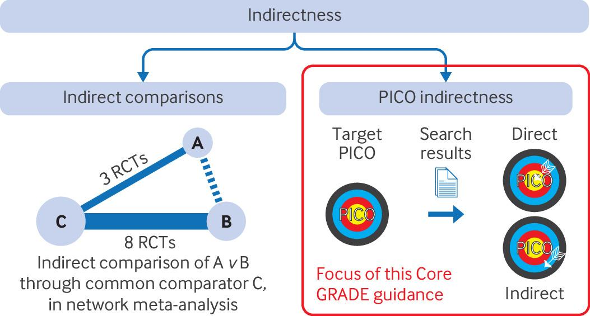

# 8 Rating Certainty of Evidence: Indirectness

## 8.1 Two types of indirectness - Indirect comparisons

GRADE guidance has used the term indirectness in two ways (Fig 4-22). In one, which we label indirect comparisons, the interest is in the relative merits of intervention A versus intervention B but evidence comes not from direct or head-to-head comparisons of A versus B. Rather, evidence comes from two sets of comparisons: A versus C and B versus C. In this indirect approach, if for instance A does far better against C than does B, we infer superiority of A over B.

 Fig 4-22: Two types of GRADE indirectness. GRADE=Grading of Recommendations Assessment, Development and Evaluation; PICO=population, intervention, comparison, and outcome; RCT=randomised controlled trial

Over the past 15 years, indirect comparisons occur when two or more interventions are compared through a common comparator rather than through direct head-to-head trials. Network meta-analyses use both direct and indirect evidence to make comparisons between multiple interventions. GRADE focuses on direct comparisons of a single intervention with a single comparator. We will therefore not deal further with indirect comparisons but instead will focus on indirectness related to PICO issues.

## 8.2 Two types of indirectness - Indirectness related to PICO issues

GRADE begins with identifying a clinical question of interest and specifying the PICO. We refer to the clinical question of interest as the target PICO.

We define indirectness as a mismatch between the target PICO and the current best evidence. Research studies provide direct evidence for the population as enrolled, the intervention and comparison provided or used by the study participants, and outcomes as measured by investigators—the PICO elements in the study as carried out.

The study as carried out may not be the study as planned. Investigators may have sought a heterogenous population but enrolled only low risk patients, anticipated high adherence to the intervention and found only low adherence, anticipated one standard of care in the comparator but observed another, or planned a long follow-up but found that a funding shortfall necessitated a short follow-up. The intent of the investigators is irrelevant to the GRADE assessors: they are only interested in what investigators carried out and its relation to the target PICO. Mismatch between the direct evidence from the study as carried out and the target PICO can occur in any of the four elements of PICO.

## 8.3 Indirectness concerns in guidelines and health technology assessments versus in systematic reviews

When researchers conduct systematic reviews independently from health technology assessments or guidelines, they can establish eligibility criteria that closely fit their target PICO and restrict their eligibility criteria accordingly. As a result, indirectness is not often a major concern in such reviews.

HTA practitioners and guideline developers must, in contrast, address questions of current interest to patients and clinicians. They choose, or are presented with, questions of sometimes urgent relevance to these target audiences. They must therefore identify and summarise the current best evidence to address those questions, even if that evidence represents a poor or limited match to their target PICO.

## 8.4 Indirectness versus inconsistency

GRADE users must attend to the possibility that intervention effects between their target PICO and available evidence will differ, requiring rating down for indirectness. On the one hand, if they have no reason to believe that relative effects differ between men and women, different drug doses, or outcomes measured over one versus three years, they will be unconcerned about applying results to women when most evidence comes from men, a higher dose when evidence comes from a lower dose, or three year outcomes when evidence comes from follow-up at one year. When, on the other hand, they believe relative effects are likely to differ, they will have concerns about indirectness.

We have dealt with this central issue—whether effects differ across subgroups of patients and interventions— in our overview of Core GRADE and when we have addressed inconsistency. In addressing inconsistency, we noted that when systematic reviewers plan to use broad PICOs in their question definition (as should usually be the case), they must be prepared to face large differences in effects across studies. This preparation involves generating a priori hypotheses for possible explanations of inconsistency, and subsequently testing these hypotheses.

How do these issues of inconsistency and issues of indirectness differ? If we have evidence from both elderly people and younger people, low dose and high dose, or long follow-up and short follow-up, we can test whether effects differ across these variables. We label such situations as potential inconsistency and ultimately consider whether results suggest different effects between subgroups, and, if they do, evaluate the credibility of possible subgroup effects.

However, if GRADE users are interested in effects in elderly people but all or almost all evidence comes from younger people, in low dose but all or almost all evidence comes from high dose, or in long follow-up but all or almost all evidence comes from short follow-up, they lack the data to test whether effects differ across these variables. Under these circumstances, they must use the indirect evidence from the younger people, the high dose, and the short follow-up to make inferences about their target PICO. The extent to which relative effects will differ across such variables becomes a matter of mechanistic reasoning based on indirect evidence from basic research or other possibly analogous conditions, rather than on direct evidence from the patients and interventions under consideration. This method is thus less secure.

## 8.5 Indirectness encountered during search for direct evidence

A search for direct evidence sometimes yields evidence with some degree of indirectness involving one or more of the four PICO elements. Patients may be older or younger than the target population, have a different ethnic background, or have a different distribution of comorbidities.

Such differences typically do not warrant rating down for indirectness. The reason, as we have pointed out, is that true subgroup effects related to such characteristics are uncommon. Differences in baseline risk of adverse or desirable outcomes, including differences in comorbidity, seldom result in differences in relative effect.

Tthere are, however, particular situations in which serious indirectness exists in studies that prove eligible in a search for direct evidence. Such situations include non-adherence to interventions, studies that focus on surrogate rather than on patient important outcomes, and problematic comparators.

## 8.6 Indirectness encountered during deliberate search for indirect evidence

When direct evidence that matches their target PICO is unavailable or of very low or low certainty, GRADE users may fall back on evidence that substantially differs from their target PICO. When GRADE users deliberately search for indirect evidence, they will inevitably confront the possibility of rating down the certainty of evidence for indirectness.

## 8.7 Neglect of indirect evidence

Developers of clinical practice guidelines sometimes mistakenly conclude that no evidence exists for a PICO of interest. Very low quality evidence may, however, be available simply from clinical experience. Moreover, clinicians may often be considering an intervention because of evidence of its usefulness in related conditions—that is, indirect evidence. Consider, for instance, the repurposing of interventions at the onset of the covid-19 pandemic. The misguided enthusiasm for hydroxychloroquine13 and ivermectin14 highlights the limitations of such indirect evidence and thus the cautious inferences that it demands.

Nevetheless, indirect evidence may, even after reviewers have considered rating down for indirectness, offer low or even moderate certainty evidence. Even if indirect evidence proves very low certainty, it remains preferable to making conclusions or decisions based on no evidence. Nevertheless, guideline developers sometimes neglect to consider indirect evidence.

For example, a guideline panel may conclude there is no evidence for a potential intervention in children. They will often, however, be thinking exclusively of direct evidence. They may, as paediatricians would likely do in their clinical practice, be able to utilise indirect evidence from adults. In another example, early in the covid-19 pandemic, no direct evidence for several interventions existed, but indirect evidence from related conditions (eg, patients critically ill with acute respiratory distress syndrome but without covid-19) was available and provided support for guideline recommendations.

Guideline developers who are not clear on the concept may use indirect evidence without explicitly labelling what they are doing. A study that evaluated guideline recommendations labelled as expert opinion found that most of these recommendations were in fact based on indirect [evidence](https://doi.org/10.1136/ebmed-2017-110798).

Bearing in mind the possibility of indirect evidence, guideline developers and HTA practitioners, when formulating search strategies for questions in which they anticipate sparse direct evidence, should seriously consider systematically searching for indirect evidence that might inform their recommendations. Experts on the review team may be aware of the likelihood of finding relevant indirect evidence, and their advice may bear on the advisability of conducting the search.

## 8.8 Examples of indirectness: differences in population

Differences in age groups constitute a common indirectness issue in patients: elderly versus younger people, or children versus adults. For example, in a guideline that addressed the management of pancreatitis in children, authors found very limited evidence for antibiotic use in this age group. They therefore conducted a search for evidence from adults, ultimately using the indirect evidence as the basis for their recommendation. Although they did not conduct a formal certainty rating, authors described the evidence as limited, acknowledging decreased certainty associated with [indirectness](https://pubmed.ncbi.nlm.nih.gov/29280782/).

Changes over time Target patients may differ in many ways from patients enrolled in research studies. For example, the characteristics of presenting patients may evolve over time, as occurred during the covid-19 pandemic. Casirivimab and imdevimab given in combination and sotrovimab given alone are monoclonal antibodies that bind to the SARS-CoV-2 spike protein, thus neutralising the virus. Randomised controlled trials conducted in 2020 and 2021 showed that both casirivimab and imdevimab combined and sotrovimab alone reduced mortality in patients infected with the circulating virus at that time, motivating World Health Organization recommendations for use of these agents.

However, changes in the sequence of the virus spike protein that occurred when omicron or its subsequent sublineages became the dominant variants resulted in substantially diminished neutralisation activity in vitro.18 The population in the target PICO had now changed from those infected with the viruses circulating earlier to those infected with the variants subsequently circulating. The panel had no direct evidence—that is, no studies of the antibodies in the era of the new virus variants were available. Nevertheless, the laboratory evidence of diminished antibody neutralisation led the panel to conclude that the original randomised controlled trials now provided only very indirect evidence for the key outcomes, the antibodies were very unlikely to be effective in the new target population, and strong recommendations against use of the antibodies were warranted.

Similar challenges arise when, in searches for direct evidence, GRADE users must rely on results from older studies when diagnostic criteria and the availability of treatments differed. Relapsing and remitting multiple sclerosis provides an example of this phenomenon.

## 8.9 Differences in condition

On occasion, when direct evidence is unavailable or of low or very low certainty, systematic review authors can look to populations with some similarity but nevertheless considerable differences from the target population. For instance, a review team addressed the choice of mechanical or bioprosthetic valves in patients with dialysis dependent end stage kidney disease who required surgery for valvular heart [disease](https://pubmed.ncbi.nlm.nih.gov/35820696/). Patients receiving mechanical valves require long term anticoagulation whereas those receiving bioprosthetic valves do not. Observational studies comparing the two valve types provided only very low certainty evidence for one of the authors’ key outcomes—postoperative and non-gastrointestinal bleeding at latest follow-up.

Given the very low certainty evidence, the authors sought indirect evidence and conducted a systematic review and meta-analysis of five randomised controlled trials of warfarin versus placebo in other populations. They found an incidence rate ratio for bleeding of 2.99 (95% confidence interval (CI) 1.46 to 6.13) which, after rating down for indirectness of the population, they considered moderate certainty evidence of increased bleeding with the mechanical heart valves.

## 8.10 Indirect evidence for harms

In rare conditions, randomised controlled trials are typically small or very small. Estimates of intervention harms may therefore yield very wide CIs warranting rating down twice for imprecision.

The interventions in such situations may have been repurposed after use in much larger populations with other conditions. Although it would be unwise to assume similar benefits across these conditions and the new indication, one might expect the adverse effects associated with a drug to be similar irrespective of the illness for which it is administered. One might therefore rate down for indirectness only once—or not at all—for harms. Accordingly, if one had high certainty evidence for harms in other conditions, one would have moderate or high certainty for the population of immediate interest.

GRADE users have applied these principles. Examples include the use of steroids in other inflammatory conditions to its use in thrombotic thrombocytopenic purpura and chronic urticaria, and allergen immunotherapy in asthma and allergic rhinitis to its use in atopic dermatitis.

Systematic review authors have also applied the same principle to related conditions to improve the precision (ie, narrow CIs) of the estimates of harms across each of these conditions. For instance, a systematic review team pooled data from trials of corticosteroid use in sepsis, acute respiratory distress syndrome, and community acquired pneumonia to generate precise estimates of adverse [effects](https://pubmed.ncbi.nlm.nih.gov/38567382/).

## 8.11 Examples of indirectness: differences in interventions

Interventions studied may differ from the target PICO in several ways, including dose of a drug (higher or lower than the target intervention), duration of administration (shorter or longer), route of administration (parenteral versus oral), or the skill level of providers of interventions such as in educational, surgical, physiotherapy, and psychosocial interventions. Another concerning common source of indirectness for such interventions is that authors may not sufficiently describe the components of the interventions and this failure can preclude their replication. For instance, the details for cardiac rehabilitation were so poorly reported in the literature that surveys of rehabilitation programmes showed that what they implemented in practice differed substantially from what randomised controlled trials had shown to be effective. Inadequate description of the intervention constitutes a reason for rating down for indirectness.

## 8.12 Non-adherence

Another common way that trials of interventions differ from the target interventions is non-adherence of patients. Generally, patients and their healthcare providers are interested in the impact of an intervention when used as intended. High levels of non-adherence introduce problematic indirectness and thus compromise the certainty of the evidence. For example, a randomised controlled trial of nortriptyline as an adjunct to nicotine replacement for smoking cessation randomised 901 adults attending a smoking cessation service to nortriptyline or [placebo](https://pubmed.ncbi.nlm.nih.gov/18441375/).

They found that one year after quit day, 11% in the nortriptyline group versus 9% in the control group (relative risk 1.26, 95% CI 0.84 to 1.87) had stopped smoking. However, much earlier, four weeks after quit day, only 59% of patients in the treatment group and 56% of patients in the control group were taking the drugs. Had adherence been close to 100%, the impact of the intervention may have been greater, the estimate more precise, and the evidence would warrant higher certainty. The trial thus provides only indirect evidence of the effect of nortriptyline on smoking cessation in those who use the intervention.

In a systematic review that included additional trials that also had concerns about adherence, the CI was narrower (relative risk 1.29, 95% CI 0.97 to 1.72) suggesting that nortriptyline may increase smoking cessation (low certainty evidence due to indirectness and [imprecision](https://pmc.ncbi.nlm.nih.gov/articles/PMC8406789/)).

Indeed, the indirectness here is serious enough that, if the target PICO specified the effects of the intervention when people use it, the extent of non-adherence would surely warrant rating down for indirectness. Even though adherence was very limited, results suggested a possible signal in favour of nortriptyline. It is entirely plausible that had adherence been very high the results would have shown a benefit of nortriptyline in improving quit rates in smokers.

Note that if the intervention of the target PICO included how nortriptyline was actually used in the community, one might conclude that the low adherence study provided direct evidence. Such targets that include considerations at the population or public health level occur particularly often in health technology assessments.

In trials of screening interventions, when the target PICO may well focus on those who are adherent, indirectness due to those who are not adherent is often a major problem. Consider a randomised trial of colonoscopy screening for colorectal cancer versus no such screening, and a PICO of interest that specifies that patients all undergo the screening intervention. The question of interest to patients would be: “What will be the impact if I undergo screening?”—and contrasts with the question of interest to the policy maker: “What will be the effect of instituting a programme in which only some of the eligible population will be interested?”

A randomised controlled trial of colonoscopy allocated more than 84 000 participants in Norway (highest participation >60%), Poland (lowest participation 33%), and Sweden to receive or not receive an invitation for colorectal screening. In the intention-to-screen analysis, the intervention reduced the relative risk of developing colorectal cancer by 18% (95% CI 7% to 30%). The absolute risk reduction was about 2 in 1000 population over 10 years—a magnitude of effect some might consider not worth the burden of screening. The evidence is, however, indirect: the investigators would presumably have seen a larger effect if all those invited had participated.

Indeed, a per protocol analysis focusing on the Norwegian population estimated that, if adherent, patients would experience a 45% relative risk reduction. With this estimate, the effect is still small but appreciably greater, about 6 per 1000 population. The per protocol analysis provides a more direct estimate but with increased risk of bias. In general, the greater the differences between the anticipated effect in a fully adherent population compared with the effect observed in the partially adherent population studied, the more likely GRADE users will rate down for indirectness.

Finally, it is possible that randomised trials in which patients achieved high adherence may provide indirect evidence from a public health or funder’s point of view. Studies of behavioural interventions that most patients find extremely challenging to follow may enroll particularly committed patients and implement adherence enhancing strategies that are unfeasible or not widely applicable. They may thus achieve adherence that is unrealistically high for clinical practice. From a public health point of view, putting resources into such interventions for typical patients who cannot achieve high levels of adherence may be a poor decision. The high adherence situation thus represents, from the policy makers’ perspective, problematic indirect evidence.

## 8.13 Trials that allow switching treatments

Oncology trials may have protocols that allow switching treatments when a patient does not respond to the original intervention. For instance, consider the relative effects of two anticancer drugs, interferon-alfa and sunitinib, in adults with renal cancer. Systematic review authors encountered trials in which participants who experienced disease progression after treatment with interferon-alfa received sunitinib and other related treatments. How might this design bear on issues of indirectness?

The answer lies in considering the target PICO. GRADE users whose target PICO designates the comparison of sunitinib alone to interferon-alfa including the proviso that patients who do not respond to the drug are offered sunitinib will find results directly applicable. Systematic review authors interested in the impact of the two drugs without such switching will, in contrast, face limitations in the directness of the results. In the latter case in which users are interested in the independent effect of the drugs, the extent of indirectness will depend on the proportion of participants in the intervention arm who switched to the alternative intervention. If the proportion of patients who switched is large, the indirectness may be considerable and warrant rating down. If few patients switched, indirectness may be minimal andnot warrant rating down.

A second determinant of the necessity to rate down would be the apparent effect of the interventions. Considering the example comparison, if substantial switching to sunitinib occurs and the result for the arm that began with interferon-alfa proves similar to that of the sunitinib arm, the issue is in doubt: is the “rescue” sunitinib responsible for the similar results, or would the results have been achieved with interferon-alfa alone? On the other hand, if sunitinib proves superior, that superiority would only have been greater had no switching occurred. In the relevant systematic review, sunitinib and other related target treatments proved superior to interferon-alfa (relative survival 1.3, 95% CI 1.1 to 1.5). Thus, indirectness does not compromise the conclusion about sunitinib’s superiority to interferon-alfa, and authors have no need to rate down for indirectness.

## 8.14 Change of intervention technology

When the intervention is a device or technology, its evolution over time can result in important indirectness that lowers certainty. For example, devices that help people manage their diabetes are constantly changing. Continuous glucose monitoring systems were approved by the Food and Drug Administration in the late 1990s and have quickly evolved with new sensor technology such that wear time has lengthened from a few days to weeks and months. “Real-time” systems, systems managed with smart phones, and systems linked to insulin delivery pumps (closed loop systems) are now available. Guidelines on diabetes technology struggled with indirectness of older evidence and have continuously balanced two strategies: excluding studies of obsolete systems versus including studies of older systems and lowering certainty due to indirectness.

## 8.15 Examples of indirectness: differences in comparators

Situations in which the comparator differs from that in the target PICO include variations in standard care between jurisdictions, use of placebo when an active treatment is the clinically relevant active comparator, inferior older alternatives rather than current optimal alternatives, and differences in dose or route of administration.37 These problems may arise in searches for direct evidence when systematic review authors do not explicitly identify their comparator.

The problematic use of placebos rather than active comparators is common, particularly in drug development trials that have the ultimate goal of obtaining regulatory approval. For example, many randomised trials of disease modifying biologics for patients with rheumatoid arthritis did not use active comparators, including trials enrolling patients with a high level of active disease, thus withholding potentially helpful treatments. While meeting regulatory requirements, such designs, by choosing suboptimal comparators, raise issues of indirectness.

The use of suboptimal comparators in industry sponsored trials is common, and include the following examples. Large industry sponsored trials evaluating newer antihypertensive drugs chose the beta blocker atenolol as the comparator, despite previous evidence showing inferiority of beta blockers to a low dose thiazide diuretic. Manufacturers of newer antipsychotic agents overestimated the advantages of reduced toxicity of their drugs by comparing them to inappropriately large doses of older alternatives. Eight such trials used fixed doses of haloperidol 20 mg/ day, substantially above recommended doses. Several studies used interferon beta-1a given intramuscularly as the comparator versus new drugs for multiple sclerosis after investigators had established the superiority of subcutaneous interferon alfa-2b.

A more recent example comes from randomised controlled trials in patients with multiple myeloma conducted in the US in which enrolment occurred between 2010 and 2020.47 The authors considered a control group regimen inferior if, before patient enrolment began, a previous randomised controlled trial had shown an improved progression-free survival versus the control group. Of 49 identified randomised controlled trials, seven (14%) began enrolling patients into inferior control groups after a study of an existing superior regimen had been published. The primary funding source in all seven was the pharmaceutical industry. These trials provide only indirect evidence for what might happen had trial investigators chosen the best available comparator. In 2000, a similar analysis of multiple myeloma trials illustrated the persistence of problems related to the selection of an inferior comparator.

Chinese investigators studying randomised trials of anticancer drugs authorised by Chinese institutional review boards between 2016 and 2021 reported a similar problem. They found that 60 (13.2%) of 453 phase 2/3 and phase 3 randomised controlled trials included a suboptimal control arm.49 In all these situations GRADE users would rate down the certainty of evidence for indirectness against the appropriate optimal comparator.

Investigators may sometimes have no choice but to use placebo comparisons to obtain indirect estimates of effects of alternative active agents. For instance, systematic review authors informing a clinical practice guideline were interested in interventions for the management of patients with X linked hypophosphataemia.50 In particular, they wanted to evaluate the impact of burosumab on pain and function, both against no specific treatment and against conventional treatment of phosphate salts and active vitamin D. The authors identified a randomised controlled trial of burosumab versus placebo that provided moderate to high certainty evidence for some of the key outcomes, but no study comparing the drug with standard of care. They offered evidence from the trial against placebo as the best estimates representing the maximum differences against standard of care, rating down once for indirectness for each outcome. Although not a satisfactory situation, the authors approach is the best possible under the circumstances.

## 8.16 Differences in outcomes

The impact of intervention versus comparators on outcomes may differ as a result of how the outcomes are measured (eg, symptomatic versus asymptomatic vertebral fracture or symptomatic versus asymptomatic deep vein thrombosis), or the duration of follow-up (short term versus long term). Outcomes may also differ by how they are measured: directly (death rates) or indirectly through surrogate measures (reduction in viral load in HIV). Such issues will arise when GRADE users include studies that measure only surrogates and not patient important outcomes.

How should GRADE users handle the situation when the available outcome is a surrogate or substitute for what patients consider important? GRADE users will specify the patient important outcome for which the surrogate is substituting and consider the degree of indirectness, inferring the impact on the patient important outcome from the surrogate and rating down certainty of evidence as appropriate. The following example provides an application of the approach.

Consider patients with mitral valve stenosis faced with the choice of percutaneous versus surgical mitral commissurotomy. A key outcome for such patients is progression of heart failure symptoms as a result of the procedure failing over the long term. Because patients with larger valve areas generally have fewer symptoms, studies comparing these procedures report the mitral valve area as a measure of success. A systematic review of randomised trials comparing the two procedures addressed their relative merits for minimising development or progression of heart failure symptoms.

The review found that no eligible studies measured patient symptoms over the long term. What investigators conducting these studies did measure was a surrogate for symptoms—mitral valve area at 30 months by echocardiography or cardiac catheterisation. The systematic review authors specified their outcome of interest as patient symptoms over the long term as inferred from the surrogate. Ultimately, they rated down the certainty of evidence for imprecision and inconsistency as well as for indirectness of the outcome, resulting in very low certainty evidence as shown in an adaptation of their summary of finding table (Table 4-3).

| Outcome                                                   | No of trials/No of patients                    | Result                                                                                                                                                                                         | Certainty of evidence                                                                |
| --------------------------------------------------------- | ---------------------------------------------- | ---------------------------------------------------------------------------------------------------------------------------------------------------------------------------------------------- | ------------------------------------------------------------------------------------ |
| Heart failure symptoms as inferred from mitral valve area | Six randomised controlled trials, 458 patients | Little or no difference in symptoms of heart failure inferred from difference in mitral valve area of 0.13 cm² higher (95% CI 0.09 lower to 0.35 higher) in patients undergoing commissurotomy | Very low due to serious indirectness, serious imprecision, and serious inconsistency |

Table 4-3: Summary of findings table addressing long term heart failure symptoms in randomised controlled trials of percutaneous versus surgical mitral commissurotomy

Although one might consider rating down more than one level for indirectness for any PICO element, this possibility is typically more salient for surrogate outcomes. For instance, in patients with end stage kidney disease, disturbances in calcium and phosphate metabolism may result in fragility fractures and myocardial infarction. Initial evidence of new therapeutic interventions focused on measures of calcium/phosphate metabolism, a very indirect measure of fractures and myocardial infarction, thus warranting rating down two levels for indirectness.

Bone density for fractures and coronary calcification for myocardial infarction represent surrogates that may be better predictors of the impact of treatment on patient important adverse outcomes and thus may warrant rating down for indirectness by only one level Thus, the decision to rate down one or two levels depends on one’s understanding of the likelihood that change in the patient important outcome will follow change in the surrogate. GRADE users addressing the possible impact that treatment effects on surrogate outcomes might have on patient important outcomes might consider exercises in which they make specific quantitative assumptions and model likely results.52 Because we see the likely gain in rigour and in soundness of conclusions as marginal, we do not see this as part of Core GRADE. Table 4-4 summarises issues in rating down for indirectness, referring back to the examples we have used and presenting the likelihood of rating down.

## 8.17 Conclusion

Limitations in the extent to which the PICO in the available studies differs from the target PICO—in GRADE called indirectness—represent a common reason for rating down certainty of evidence in the development of guidelines and health technology assessments. When direct evidence is unavailable or of low or very low certainty, GRADE users should consider searching for indirect evidence that may result in higher certainty evidence. Whenever the PICO elements in the relevant studies do not completely correspond with GRADE users’ target PICO, they must consider the likelihood that these differences will result in important variation in intervention effects, and if that is likely they should rate down by one level for indirectness or—particularly with surrogate outcomes—by two levels.
