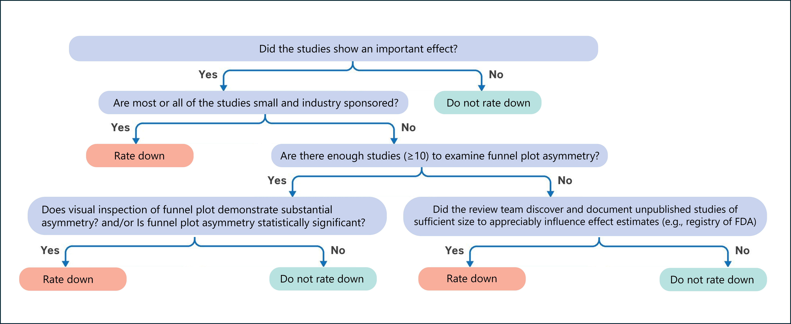
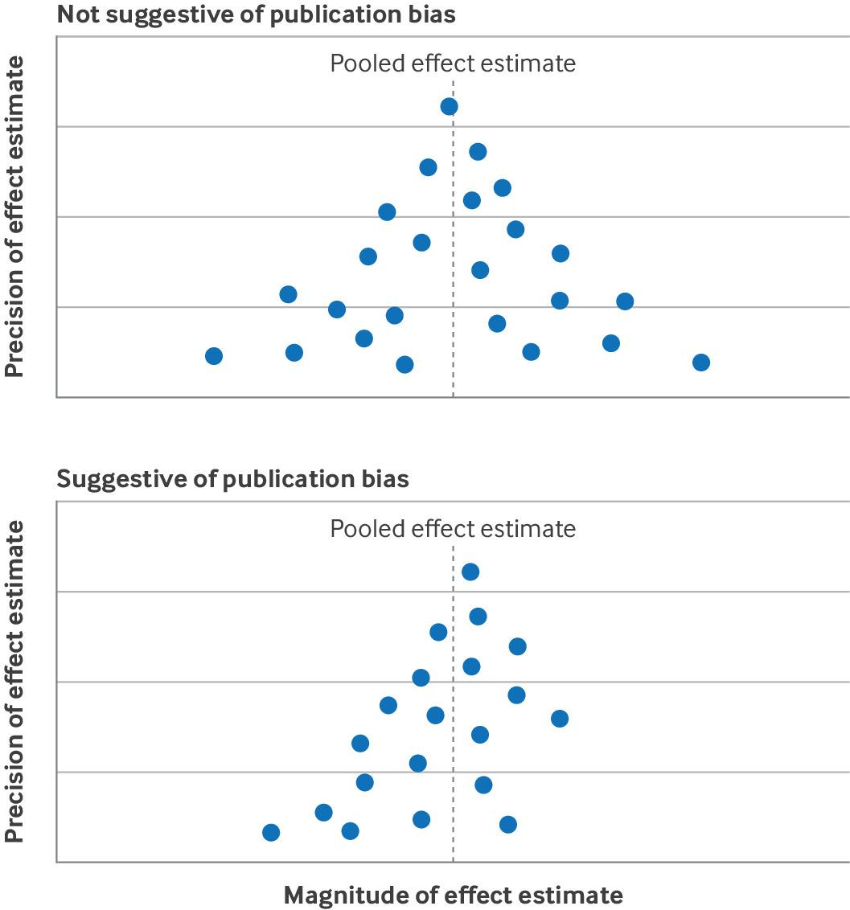
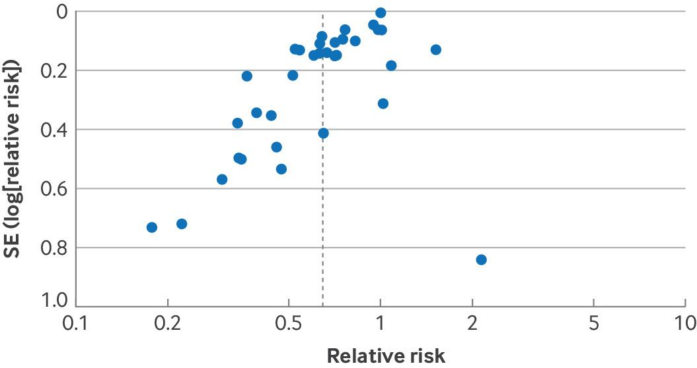

# 9. Publication Bias

## 9.1 What is publication bias

Publication bias refers to the bias in the pooled estimate of effect that results from failure to publish studies based on their results—typically studies with negative findings. Analyses of trials registered with institutional review boards have shown selective non-publication of studies with negative or statistically non-significant results. The effect has proved greater in NRSI than randomised trials.

There are at least three causes of selective non-publication of studies with negative results. Firstly, authors may fail to submit studies for publication because of a perception that journals will consider negative results uninteresting. Secondly, journal editors and their peer reviewers may indeed find negative results uninteresting and reject manuscripts on that basis. Thirdly, for commercially funded studies, it is in the interest of funders motivated to maximise use of their product to suppress negative results and thus create an impression of larger than actual beneficial effects.

## 9.2 Avoiding publication bias: comprehensive search

Consideration of publication bias creates a unique problem for GRADE users: one is guessing at the presence of something that one cannot document. Systematic reviews with a less than comprehensive search may not locate studies published in non-indexed or non-English journals, or studies in registries (eg, clinicalTrials.gov) or regulatory databases (eg, FDA and European Medicines Agency), thus raising the possibility of conducting searches from these sources. For example, a systematic review of leukotriene receptor antagonists for chronic urticaria identified 24 out of 34 relevant randomised controlled trials in Chinese.

Nevertheless, the likely low yield precludes the necessity of such searches in all or even most cases. Searches may, however, be desirable in some instances, such as in Chinese databases when conducting a systematic review of traditional Chinese medicine. Even a comprehensive search will not, however, detect studies with a delay to publication, that were never submitted, or [that do not appear in any study registries](https://pubmed.ncbi.nlm.nih.gov/38852861/).

## 9.3 Addressing publication bias

Publication bias, when present, will typically result in an overestimation of effect. Thus, when pooled estimates suggest an important effect, reviewers should consider whether it is the result of publication bias. Fig 9-1 shows the steps Core GRADE users can follow to decide whether to rate down certainty of evidence for publication bias.

Fig 9-1: Flow chart depicting process of deciding whether to rate down certainty of evidence for publication bias

## 9.4 Commercial funding

In one example of selective publication by manufacturers, a [systematic review examining the effect of reboxetine on acute treatment of major depression ](https://pubmed.ncbi.nlm.nih.gov/20940209/)retrieved both published trials from databases and unpublished data from the manufacturer of reboxetine. Results showed that published data overestimated the benefit of reboxetine by as much as 115% compared with placebo and 23% compared with selective serotonin reuptake inhibitors.

In another example, a [study investigated 74 antidepressant trials registered by the Food and Drug Administration (FDA) and found selective publication based on FDA ](https://www.nejm.org/doi/full/10.1056/NEJMsa065779)deemed results from 38 studies as positive, of which 37 were published. Among the 36 trials with results deemed as negative or questionable, 22 were not published and 11 were published as positive.

[Another study analysed 400 randomly selected trials registered on ClinicalTrials.gov for their public disclosure of results](https://pubmed.ncbi.nlm.nih.gov/25025477/). Overall, 118 trials (29.5%) failed to make their results public within four years of completion. Commercially funded trials (adjusted hazard ratio 0.49, 95% CI 0.36 to 0.66) were less likely to be published or were published later.

In all these examples, authors had access to the results of unpublished studies, established they provided much less sanguine results, and thus had definitive evidence of publication bias. Reviewers may be aware that eligible studies exist, but results may be unavailable. If that is the case, and the sample size of those studies is large enough to impact substantially on overall results, reviewers should rate down for publication bias.

Reviewers may rate down for publication bias even when they have not identified specific unpublished studies. Because of the concern about the impact of industry sponsorship on selective publication, GRADE users should consider rating down for publication bias when the available studies are all small and industry sponsors have conducted most or all of the studies. For instance, a [systematic review of flavonoids in patients with haemorrhoids](https://bjssjournals.onlinelibrary.wiley.com/doi/10.1002/bjs.5378) that found large relative risk reductions in bleeding and pain identified 11 studies ranging in size from 40 to 234 participants all of which were industry sponsored.

## 9.5 Funnel plots and statistical tests

GRADE users can assess risk of publication bias by visually inspecting the funnel plot—a scatter plot in which each dot represents a study included in the meta-analysis. The horizontal axis shows the magnitude of effect estimate of the individual studies (e.g, log odds ratio, mean difference) and the vertical axis shows precision of the estimate of effect (e.g, inverse of standard error, sample size).59

In a funnel plot, larger studies with more precise results are displayed at the apex, and because they are more precise should be closer to the pooled estimate of effect. Smaller studies with lower precision scatter more widely at the bottom and should be symmetrically distributed around the pooled effect estimate. Thus, distribution of the dots should resemble a symmetrical inverted funnel (top panel in Fig 9-2).

Fig 9-2: (Top) Funnel plot not suggestive of publication bias. (Bottom) Funnel plot suggestive of publication bias. (Bottom) Funnel plot suggestive of publication bias

If the funnel plot is asymmetrical with a missing quadrant of small studies with negative results, publication bias represents a plausible explanation (bottom panel in Fig 9-2). However, other explanations include small studies being biased in favour of the intervention, or small studies more faithfully following the intervention and thus achieving more favourable results. Given these alternative explanations we sometimes refer to such asymmetrical funnel plots as showing small study effects.

Fig 9-3 presents an example of funnel plot asymmetry from a systematic review investigating the effects of probiotics on risk of acute infectious diarrhoea lasting ≥48 hours.60 Here, several small studies favour probiotics to a greater extent than the large studies but only one small study is less favourable than the large studies. Such a result warrants serious consideration of rating down for publication bias.

Fig 9-3: Funnel plot from a systematic review investigating effects of probiotics on acute infectious diarrhoea suggested high risk of publication bias. SE=standard error

Using funnel plots to test publication bias does, however, have limitations. Visual inspection of asymmetry involves subjectivity that is prone to error. Statistical approaches to test the asymmetry of funnel plots, including Egger's regression test and Begg's rank test, are available but have been criticised for both false negative rates and false positive rates. 6 The use of statistical tests requires a meta-analysis including ≥10 studies, also preferable for making inferences about funnel plot asymmetry.

Because of the limitations of the approaches for assessing publication bias, GRADE users will often be left with uncertainty. GRADE therefore suggests using the terms undetected (when no evidence suggests publication bias and they thus do not rate down certainty, the usual situation) and strongly suspected (when evidence suggesting publication bias exists and they do rate down certainty) to describe the publication bias domain.

## 9.6 Selective outcome reporting: Its relationship to publication bias and risk of bias

One type of selective outcome reporting occurs when the results for an outcome of interest in some studies are unfavourable and consequently the investigators do not report the results. In such instances, these studies do not contribute to the meta-analysis for that outcome. One can suspect selective outcome reporting when outcomes specified in the study protocol are not reported in the final publication, or one anticipates certain outcomes that authors omit in study publication while they report less critical ones. Since the funnel plot and test for funnel plot asymmetry can detect this problem, it is addressed in the publication bias domain.

Another type of selective outcome reporting occurs when studies report the results for the outcome of interest but the reported result is selected from multiple available effect estimates (eg, multiple time points, multiple outcome measurement methods, or multiple analytical approaches) or the the outcome measurement is inconsistent between the protocol and the publication report. Non-randomized studies of interventions, in which pre-registered protocols are far less likely to prespecify which of the possible results will be included in the analysis, require special attention since reporting bias may be enormous. This type of selective outcome reporting should be addressed as risk of bias in individual studies rather than publication bias.
