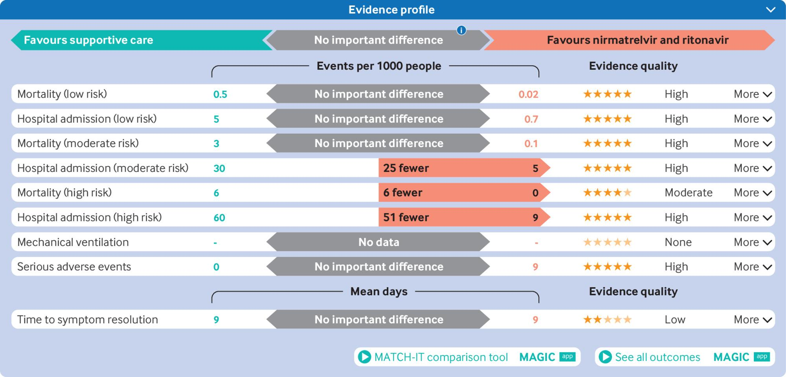

# 11 Presenting the evidence in summary of findings tables

Summary of findings tables represent a key GRADE innovation providing an optimal structure to present benefits and harms that clinicians, patients, and decision makers require to guide their choices. Summary of findings tables systematically present numerical results, including the relative and absolute effects, that show the impact of alternative interventions on prioritised patient important outcomes, and the associated certainty of evidence. In this section, we first describe the components of summary of findings tables and then present considerations for calculating relative and absolute effects for binary outcomes and issues related to presentation of continuous outcomes. We then address problems related to choice of outcomes, what to do when one is unable to pool data through meta-analysis, questions informed by more than one source of evidence, and use of online software for the production and dissemination of summary of findings tables.

This material will enable GRADE users to understand the key components in summary of finding tables, including relative and absolute effects, the certainty of evidence, plain language summaries, and reasons for rating certainty of evidence up or rating down; calculate absolute effects for binary outcomes by applying relative risk estimates to baseline risk; choose the most appropriate presentation format for pooled effect measures when individual studies use different instruments to measure the same continuous outcome; and understand considerations in using software for creating summary of findings tables.

## 11.1 Components of summary of findings tables

For each outcome of interest, summary of findings tables summarise the evidence addressing the effects of interventions versus comparators and the certainty of that evidence, as well as reasons for rating down or up (Table 4-5). Each row in the table focuses on a single outcome presented in the first column. Subsequent columns present the number of participants, number and type of studies, relative and absolute effects presented as risk differences, certainty of evidence, and a plain language summary describing the effect. Although the format for presenting summary of findings tables may differ, the key information they present should not. A format we refer to as an evidence profile represents an alternative (Alternative format for summarizing Evidence [profile](assets/appendix/21.Summary%20of%20Fiinding%20Alternative%20format%20for%20summarizing%20the%20evidence-%20Evidence%20Profiles.pdf)).

| Outcome and follow-up                                                                                                                | No of participants (No of studies and type) | Relative effect (95% CI)                                                                                                                                                                      | Absolute effects (95% CI)                                                                                  | Certainty of evidence                                                                 | Plain language summary                                                                                   |
| ------------------------------------------------------------------------------------------------------------------------------------ | ------------------------------------------- | --------------------------------------------------------------------------------------------------------------------------------------------------------------------------------------------- | ---------------------------------------------------------------------------------------------------------- | ------------------------------------------------------------------------------------- | -------------------------------------------------------------------------------------------------------- |
| 
Mortality (Risk of death) Follow-up: longest, range 7.7-60 months
                                                          | 1821 (11 non-randomised studies)            | Hazard ratio 0.78 (0.69 to 0.89)                                                                                                                                                              | 
One year risk of dying 578 per 1000* → 490 per 1000 88 fewer per 1000 (129 fewer to 42 fewer)
 | 
Low† Due to non-randomised studies
                                          | Intensive antileukaemic treatment may decrease mortality                                                 |
| 
Mortality (Proportion of people who died) Follow-up: one year
                                                              | 87 (one randomised controlled trial)        | Risk ratio 0.83 (0.61 to 1.13)                                                                                                                                                                | 
558 per 1000 → 463 per 1000 95 fewer per 1000 (218 fewer to 73 more)
                             | 
Low Due to very serious imprecision‡
                                        | Intensive antileukaemic treatment may decrease mortality                                                 |
| 
Complete remission duration in months (or time to relapse) Follow-up: longest, range 13.3-60 months
                        | 593 (four non-randomised studies)           | Four studies reported this outcome. Three of the four reported a shorter remission with intensive treatment. The difference in duration ranged from 3.1 months shorter to 0.03 months longer. | -                                                                                                          | 
Very low Due to serious imprecision†§
                                       | We are very uncertain about the effect of intensive antileukaemic treatment on complete remission        |
| 
Serious adverse events (Proportion of people who had treatment emergent adverse events) Follow-up: longest, median 5 years
 | 190 (one non-randomised study)              | Risk ratio 1.34 (1.03 to 1.75)                                                                                                                                                                | 
463 per 1000 → 621 per 1000 157 more per 1000 (14 more to 347 more)
                              | 
Very low Due to serious risk of bias and imprecision†¶**
                    | We are very uncertain about the effect of intensive antileukaemic treatment on serious adverse events    |
| 
Duration of hospital stay Follow-up: longest, range 20-60 months
                                                           | 370 (three non-randomised studies)          | -                                                                                                                                                                                             | 
24.36 days → 37.32 days 12.96 more days (16.23 fewer to 42.15 more)
                              | 
Very low Due to very serious inconsistency and very serious imprecision††‡‡
 | We are very uncertain about the effect of intensive antileukaemic treatment on duration of hospital stay |
| Quality of life impairment—not reported                                                                                              | -                                           | -                                                                                                                                                                                             | -                                                                                                          | -                                                                                     | -                                                                                                        |

CI=confidence interval; MID=minimal important difference.\
\* Event rate from one year mortality was used for less intensive treatment (from non-randomised studies).\
† Body of evidence is from non-randomised studies—assessment of certainty of evidence started at low.\
‡ Using an MID of 50 per 1000, the 95% CI suggests the possibility of an important benefit and an important harm, thus rating down two levels for imprecision.\
§ Meta-analysis was not possible, but it is likely that the pooled estimate would have crossed the null.\
¶ The study was at serious risk of bias due to confounding and at moderate risk of bias due to deviation from intended interventions, thus rating down two levels for risk of bias.\
\*\* Using an MID of 10%, the 95% CI suggests the possibility of trivial and important harm.\
†† Not all CIs of the studies overlap, and the statistical heterogeneity is high (I2=99%).\
‡‡ Using an MID of five days, the 95% CI suggests important benefit and important harm.

Assessing the certainty of evidence involves choices and judgment. Those making the judgments must communicate their rationale in succinct, explicit, and transparent footnotes (ie, explanations) with the summary of findings table. This is one of the strengths of GRADE: although two GRADE users may arrive at different judgments when looking at the same body of evidence, providing sufficient information for readers to understand their rationale will clarify the reasons for disagreement.

For instance, they may have chosen different thresholds for the minimal important difference (MID), the smallest magnitude of effect that patients consider important. Understanding these reasons may allow, in different contexts, adaptation of existing summary of findings tables to different choices or judgments. Explanations should be concise, informative, relevant, easy to understand, and accurate. (Writing footnotes to explain certainty of evidence [judgments](assets/appendix/20.Summary%20of%20Findings-%20Writing%20footnotes%20to%20explain%20judgments%20of%20certainty%20of%20evidence.pdf)) A previous GRADE paper provided guidance for wording plain language summaries communicating the effects while conveying the assigned level of certainty of the evidence, thus facilitating understanding of evidence [summaries](https://doi.org/10.1016/j.jclinepi.2019.10.014). Box 1 summarises this guidance as well as additional guidance related to the null and MID thresholds that are the focus of Core GRADE.

### Box 1: Writing standardised GRADE plain language summaries in summary of findings tables

Standardised plain language summaries should convey, for each outcome, information about the certainty of the evidence and the effect of the intervention. The following qualifiers then inform the direction of the effect:

* **High certainty:** reduces, increases, or has little to no effect
* **Moderate certainty:** probably (likely) reduces, increases, or has little to no effect
* **Low certainty:** may (possibly) reduce, increase, or have little to no effect
* **Very low certainty:** the evidence is very uncertain; or the effect is very uncertain

When focusing on the target of certainty in relation to the null, plain language summaries should communicate that there is a benefit or harm, which is to be understood as a non-null effect. Examples:

* **High certainty:** knee arthroscopy increases function
* **Moderate certainty:** knee arthroscopy probably (likely) increases function
* **Low certainty:** knee arthroscopy may (possibly) increase function
* **Very low certainty:** the effect of knee arthroscopy on function is very uncertain

When focusing on the minimal important difference, plain language summaries should communicate that there is an important benefit or harm, or alternatively that there is little to no important effect. Examples:

* **High certainty of an important effect:** knee arthroscopy results in an important increase in function
* **Moderate certainty of little to no effect:** knee arthroscopy probably has little to no important effect on function
* **Low certainty of an important effect:** knee arthroscopy may (possibly) result in an important increase in function
* **Very low certainty:** the effect of knee arthroscopy on function is very uncertain

GRADE=Grading of Recommendations Assessment, Development and Evaluation.

## 11.2 Presenting dichotomous outcomes: Relative measures of effect

We have emphasised in both the first and the second article in this series dealing with establishing the target of certainty rating and rating down for imprecision1 2 that relative risks are usually similar across different baseline risks. Thus, systematic review authors will usually conduct meta-analyses of relative effects, using either relative risks, odds ratios, or hazard ratios. Relative risks are easier to interpret than odds ratios and facilitate estimation of absolute effects, making it the preferred measure from a user’s perspective. The odds ratio, however, can address problems that occur with relative risks when baseline risks are high (>50%). Such situations are unusual and relative risks usually serve well.

One can interpret hazard ratios, which consider not only if an event occurs but when it occurs, similarly to relative risks. Investigators often use hazard ratios when mortality is the outcome of interest and death rates are high, as in the specialty of oncology (Table 4-5, first and second row). Under these circumstances, duration of survival becomes the most important factor for patients.

Because patients and key stakeholders are primarily concerned about absolute rather than relative effects, summary of findings tables include absolute measures—risk differences—for key binary outcomes.To generate risk differences, they apply relative estimates that come from the meta-analyses to baseline risks. In making their decisions, they consider the magnitude and associated certainty of those absolute effects. The next section presents the method of calculating and how to present absolute effects.

## 11.3 Calculating and presenting absolute measures of effect: Applying relative effects to baseline risks

Because they depend on baseline risks, absolute effects vary from one clinical scenario to another. Therefore, the first step for GRADE users when calculating absolute effects is to select a specific baseline risk for the patient group under consideration. In doing so they should decide on a time frame for measuring outcomes and in general use that same time frame for all outcomes.

Use of the same time frame for all outcomes is not an absolute rule. For example, it is not unusual for benefits to occur over a short time frame but for rare serious events to occur only over the long term. A summary of findings table needs to report both outcomes using the appropriate time frame.

Because of the often selective sampling process in many randomised trials, the baseline risk will ideally come from a rigorous, large observational study that includes a more generalisable population, a systematic review of such studies, or a large pragmatic trial with broad eligibility criteria. Such studies are often unavailable and as a result systematic review authors will often use the median event rate in the comparator arms across all randomised trials included in the review.

To obtain risk differences, authors apply pooled relative effects to chosen baseline risks. To illustrate with an example, consider the outcome mortality as calculated from randomised controlled trials—row 2 in Table 4-5. The body of evidence (in this case from a single randomised trial) suggests that, when comparing intensive versus less intensive antileukaemic treatment, the relative risk is 0.83 (a 17% relative risk reduction). Applying this relative risk reduction to the baseline risk of death among older adults who receive less intensive antileukaemic treatment (56%), the absolute risk reduction with intensive antileukaemic treatment is calculated as 17% multiplied by 56%, equaling a 9.5% absolute risk reduction. (Calcuating absolute effects based on baseline risks an relative [effects](assets/appendix/19.Summary%20of%20FindingsL%20Calculating%20absolute%20effect%20based%20on%20baseline%20risk%20and%20relative%20effect.pdf))

## 11.4 Different risk groups

Clinicians can sometimes, considering prognostic factors for outcomes of interest, identify patients with sufficiently different baseline risks to warrant different management strategies. When this is the case, GRADE users may present separate risk differences for patient groups at varying risk of events, which can lead to different decisions.

Table 4-6 presents an example from a systematic review supporting the development of recommendations regarding the use of sodium-glucose cotransporter-2 (SGLT-2) inhibitors versus standard care for people with type 2 diabetes.19 20 The guideline authors, aware of the large gradients in risk of death in people with type 2 diabetes depending on their risk factors and cardiovascular and renal morbidities, made recommendations taking into account these baseline risks. The guideline panel identified five risk strata and ultimately made recommendations specific to each stratum. Here, we highlight results for the most important outcome, all cause mortality, from the two extremes: people at lowest risk and those at highest risk.

| Outcome                                                                                                                             | Time frame: five years | Study results and measurements                                                                         | Standard care | SGLT-2 inhibitors                                                      | Certainty of evidence | Plain language summary                                                       |
| ----------------------------------------------------------------------------------------------------------------------------------- | ---------------------- | ------------------------------------------------------------------------------------------------------ | ------------- | ---------------------------------------------------------------------- | --------------------- | ---------------------------------------------------------------------------- |
| All cause mortality (very low risk: adults with ≤3 risk factors and no underlying cardiovascular disease or chronic kidney disease) | -                      | 
Odds ratio 0.77 (95% CI 0.71 to 0.83) Based on data from 282,704 participants in 225 studies
 | 20 per 1000   | 
15 per 1000 5 fewer per 1000 (95% CI 6 fewer to 3 fewer)
     | High                  | There is no important difference between SGLT-2 inhibitors and standard care |
| All cause mortality (very high risk: patients with cardiovascular disease and chronic kidney disease)                               | -                      | 
Odds ratio 0.77 (95% CI 0.71 to 0.83) Based on data from 282,704 participants in 225 studies
 | 265 per 1000  | 
217 per 1000 48 fewer per 1000 (95% CI 61 fewer to 35 fewer)
 | High                  | SGLT-2 inhibitors reduce the risk of death compared with standard care       |

CI=confidence interval; SGLT-2=sodium-glucose cotransporter-2.

The authors began by conducting a meta-analysis to calculate the relative effects of SGLT-2 inhibitors on mortality across the entire population and reported an odds ratio of 0.77 with a 95% confidence interval (CI) from 0.71 to 0.83 (Table 4-6). The authors explored possible subgroup differences in relative effects across risk groups. They found no evidence of effect modification, including at the extremes of baseline risk. They therefore applied the relative risk to the baseline risks in the two risk groups over a period of five years (20 per 1000 deaths in people at very low risk; 265 per 1000 in the highest risk group).

The result was a risk difference of 5 fewer per 1000 with SGLT-2 inhibitors in the lowest risk group and 48 fewer per 1000 in the highest risk group. The synthesis team presented the evidence for all five subgroups in the summary of findings in adjacent rows—Table 4-6 does so for the highest and lowest risk groups. Considering not only mortality but other relevant outcomes, the panel made a weak recommendation against treatment in the very low risk group and a strong recommendation in favour in the very high risk group.

In other situations, particularly when displaying multiple important outcomes, it may be appropriate to develop separate summary of findings tables for each risk group. Using different risk groups may lead to different targets of certainty rating, as it did here (target little or no effect in the low risk group and an important effect in the high risk group). This may then result in different decisions about precision and inconsistency.

Here, using an MID in mortality of 10 in 1000, the entire CI for the low risk group fell in the range of no important effect and in the high risk group fell entirely in the range of an important effect, in both cases indicating no serious imprecision.

## 11.5 Directly calculating risk differences

Calculating risk differences by applying relative effects to baseline risks may, in some scenarios, result in misleading point estimates of effect and even more misleading and asymmetrical CIs. Such results often occur when the outcome is rare (event rates <2% and most problematic <1%). Faced with this problem, rather than conducting meta-analysis of relative effects, review authors should generally conduct meta-analyses of risk differences. (Calculating and presenting absolute measures of effect: Directly calculating risk [differences](<assets/appendix/18.Summary of Fiindings- Calculating and presenting absolute measures of effect - Directly calculating risk differences[1].pdf>))

## 11.6 Presenting continuous outcomes: When studies use the same measure

In many cases, studies reporting an outcome measured as a continuous variable use the same instrument or scale across studies. Take, for instance, length of hospital stay (measured in days) in Table 4-5 or pain (often measured using a 10 cm visual analogue scale) in Table 4-7.

| Outcome                                                                                                                   | Time frame   | Studies and measurements                                                                                                                                                                               | Conservative management | Arthroscopy                                                                           | Certainty of evidence                                                                             | Plain language summary                                                                         |
| ------------------------------------------------------------------------------------------------------------------------- | ------------ | ------------------------------------------------------------------------------------------------------------------------------------------------------------------------------------------------------ | ----------------------- | ------------------------------------------------------------------------------------- | ------------------------------------------------------------------------------------------------- | ---------------------------------------------------------------------------------------------- |
| 
<strong>Option 1</strong> Pain (difference in change from baseline)
                                             | Three months | 
Measured by different instruments converted to scale of index instrument (KOOS pain subscale—MID 12) Scale 0-100, higher scores better Based on data from 1231 participants in 10 studies
 | Mean 15.00 points       | 
Mean 20.00 points Mean difference 5.38 more (95% CI 1.95 more to 8.81 more)
 | 
Moderate*† Different pain summary measures suggest different effects
                    | Knee arthroscopy probably does not result in an important reduction in pain                    |
| 
<strong>Option 2</strong> Pain (difference in proportion of patients who achieve a change greater than the MID)
 | Three months | 
Based on data from 1102 participants in nine studies Follow-up three months‡
                                                                                                                 | 669 per 1000§           | 
793 per 1000 Difference 124 more per 1000 (95% CI 44 more to 204 more)
      | 
Low†¶ Serious imprecision and different pain summary measures suggest different effects
 | Knee arthroscopy possibly increases the number of patients with an important reduction in pain |
| 
<strong>Option 3</strong> Pain (SMD in change from baseline)
                                                    | Three months | 
Measured by different instruments with different scales Scale: Higher scores better Based on data from 1231 participants in 10 studies
                                                    | Mean 15.00              | 
Mean 17.04 SMD 0.16 higher (95% CI 0.03 higher to 0.28 higher)
              | 
Low†** Serious imprecision and different pain summary measures show different effects
   | Knee arthroscopy possibly does not result in an important reduction in pain                    |

CI=confidence interval; KOOS=Knee injury and Osteoarthritis Outcome Score; MID=minimal important difference; SMD=standardised mean difference.\
\* Although the I2 statistic was high, all point estimates suggested little to no effect and therefore no rating down for inconsistency.\
† Some pain summaries suggest small but important differences in pain, whereas others suggest only unimportant differences, warranting rating down for inconsistency.\
‡ Because one study provided data allowing calculation of the portion of patients who achieved a change greater than the MID, 10 studies were relevant for options 1 and 3 and nine for option 2.\
§ Baseline risk of 669 per 1000 based on the median of number of people who achieved an improvement of MID or greater in the conservative management groups.\
¶ Using an MID of 100 per 1000 patients (10%), the 95% CI crosses this threshold, suggesting the possibility of a trivial benefit and thus warranting rating down for inconsistency.\
\*\* Using Cohen's threshold for interpretation of SMD, the 95% CI crosses the MID (small effect threshold) of 0.2, suggesting the possibility of an important benefit and thus warrants rating down for imprecision.

When studies use the same measure, an intuitive measure of effect is the mean difference. Because natural units (that is, the units of the outcome measure, for instance hospital days, or, in Table 4-7, option 1, the units of the KOOS (Knee injury and Osteoarthritis Outcome Score) pain scale rather than statistical units such as the standardised mean difference) are used, GRADE users present the mean difference in the absolute effects column. To facilitate interpretation, the preferred approach is to provide information about the outcome in the comparison group (for example, in Table 4-5 the median duration of hospital stay in the control arm was 24 days), the intervention group (37 days in Table 4-5), and the difference between the two (13 days).

In addition to describing the time point of interest and method of measurement of the outcomes (eg, visual analogue scale, KOOS pain scale, days in hospital), the summary of findings table should provide, when it is not obvious, the range and direction of the scale or the units in which the results are presented. For example, blood loss may be presented in millilitres or ounces, and visual analogue scales for measuring pain are used with ranges of 0-10 cm or 0-100 mL—the interpretation of the same mean difference of 2 points will be very different if a 10 point scale versus a 100 point scale is used. Similarly, some patient reported outcomes might be measured with instruments in which higher scores signify better outcomes, and others in which lower scores signify better outcomes (we present an example in the next section). GRADE users should therefore communicate the direction of the instrument’s scale.

Finally, perhaps the most useful way of ensuring the interpretability of the outcome is to designate the smallest difference patients perceive as important, the MID. For instance, a footnote in Table 4-5 specifies the MID for reduction in hospital stay of five days and the first row in Table 4-7 specifies the MID for the KOOS pain scale of 12.

## 11.7 When studies use different measures

Researchers sometimes measure the same outcome using different instruments. This most often occurs in health status measures that address constructs such as health related quality of life, function, or severity of symptoms. Multiple instruments are often available, and investigators make different choices for their studies. When this occurs, it presents challenges for systematic review authors.

Table 4-7 presents an example from a systematic review assessing the effect of knee arthroscopy versus conservative management in people with degenerative knee disease2 developed to support a guideline. Across the included randomised trials, researchers used seven different instruments to measure the outcome of function related to knee arthritis. When preparing their summary of findings table, GRADE users have several options for summary effect measures, three of which are illustrated in Table 4-7. A previous GRADE paper provides additional details of the [alternatives](https://doi.org/10.1016/j.jclinepi.2012.08.001), and another previous paper details the statistical methods [involved](https://doi.org/10.1002/jrsm.46).

Option 1: Using the mean difference on the scale of an index instrument When one of the instruments is more commonly used and understandable than others (the index instrument), Core GRADE users can convert the other scores into the scale of the index instrument. They then conduct the meta-analysis using the mean difference on the index instrument as the measure of effect. In the example, clinical experts suggested KOOS, which uses a scale of 0-100 (with higher scores representing better function), as the index instrument.

When studies reported function using the Western Ontario and McMaster Universities’ arthritis index domain (range from 0 to 68, with higher scores representing worse function) transforming to a scale of 0-100 and reversing the direction allowed combining results across studies using the mean difference (Table 4-7, first row). When choosing this option, systematic reviewers are likely to require different conversions for each instrument (for example, scores from the Arthritis Impact Measurement Scale, with a range 0-10, multiplied by 10) or may need no conversion at all if another instrument uses the same range (for example, SF-36 survey scores also have a scale from 0 to 100 in the same direction as KOOS).

Authors can then make the results on the index instrument interpretable by relating it to the MID. In this case, the best estimate of the KOOS MID is 12 units.34 Because the mean difference (5.38) is much less than the MID, one can conclude that any improvement as a result of the intervention is small and likely unimportant.

Option 2: Presenting data as binary outcomes If systematic reviewers or guideline developers know what the MID is for each of the instruments and assume a normal distribution of results, they can calculate the proportion of people who experience an improvement larger than the MID within each arm, thereby obtaining a risk ratio or risk difference for each of the studies. They can then pool these proportions across studies. Alternatively, if an MID for each instrument is not available, reviewers can convert scores into the scale of the index instrument with a known MID. Based on the results of a systematic review of the literature addressing MIDs across instruments, the second row of Table 4-7 shows the results of such an analysis. A previous paper describes the underlying statistical [methods](https://doi.org/10.1002/jrsm.46).

Option 3: Calculating the standardised mean difference When included studies assess the same outcome but measure it using a variety of different scales review authors sometimes choose another option, the standardised mean difference (SMD) as a summary statistic. By dividing the mean difference between the treatment and control groups by the pooled sample standard deviation in each study at a specific time point, the SMD converts the results of all studies to standard deviation units.

The SMD is prone to major problems. Firstly, SMDs express the size of the treatment effect in each study relative to the variability observed in that study. Many may find the resulting treatment effect reported in standard deviation units rather than the original units of measurement difficult to interpret. Secondly, although guidance is available to interpret SMDs (ie, an SMD of 0.2 is the threshold for a small and important effect),40 clinicians may be appropriately sceptical of this threshold, which is limited by large variability in the methods investigators use to calculate the SMD. Lastly, the SMD bears a highly variable relation to the actual magnitude of effect: in two studies with exactly the same magnitude of effect, the SMD will be much larger in a study that enrolls a homogeneous population than in one that enrolls a heterogeneous population.

All these options have limitations. Although the SMD (option 3) remains the most used summary statistic, for the reasons we have noted, it is often the least satisfactory. Review authors should consider using the SMD only when the outcome is reported using multiple scales and no instrument measuring the construct has a credible MID available. For many clinicians, using natural units in relation to their MIDs (option 1) remains an unfamiliar approach, and in interpreting results they must avoid the temptation of inferring that any effect smaller than the MID is unimportant. Converting the continuous to a binary outcome (option 2) is appealing in that this clinicians are familiar with this presentation. Other options remain available, including the ratio of means, a presentation that some find intuitive and appealing.

We suggest presenting the mean difference and interpreting these differences in relation to the MID (option 1), as well as the binary outcome approach (option 2). If results are concordant between these approaches, review authors may make strong inferences about the apparent magnitude of effect. If not, inferences about magnitude must be weaker. Indeed, in Table 4-7 the methods that present a continuous variable (options 1 and 3) suggest a small and likely unimportant effect, whereas the binary approach (option 2) provides a point estimate of 12.4% more individuals who gain an important improvement, an effect that most patients are likely to consider important.

GRADE users will acknowledge such discrepancies between interpretations of results and rate down certainty of evidence accordingly. They must still, however, take responsibility for a coherent message for clinicians and patients who rely on them for guidance. Given the evidence in Table 4-7, conclusions of little or no effect or a small but important effect are both reasonable. Guideline panels will need to come down on one side or the other and present results in their summary of findings tables that support their inference. The text discussion should, however, present alternative results in explaining the lower certainty of evidence supporting their ultimate inferences.

## 11.8 Additional considerations for summary of findings tables: Choosing which outcomes to present

Previous GRADE guidance suggested limiting the number of outcomes to seven, but this may not adequately serve the needs of the target audiences of a particular systematic review. For instance, target audiences may be interested in the effect of an intervention at different time points; they may wish to see different ways of presenting the outcome, such as in the example in Table 4-7, including both as a dichotomous and as a continuous outcome; they may wish to see evidence for a single outcome from both non-randomised studies and randomised trials such as for the outcome mortality in Table 4-5; if no evidence is available for a critical or important outcome, GRADE users may consider including a row that describes this explicitly (eg, outcome quality of life in row 6 of Table 4-5). For all these reasons, decision makers or clinician audiences may require tables that have more than seven rows.

Thus, when creating summary of findings tables, we suggest being parsimonious but flexible and using online supplementary material and digital publication platforms that allow the publication of interactive or additional summary of findings tables (see section “Software”). What GRADE users should not do is have rows for outcomes that overlap (eg, all cause mortality and cardiovascular mortality) because of the risk of double counting, as occurred in a summary of findings table that included both overall major bleeding and gastrointestinal [bleeding](https://guidelines.gradepro.org/profile/54B577E9-7F80-3A78-B3EA-3850E9A1D432).

## 11.9 When data cannot be pooled

While one can, for individual studies, always present quantitative data that authors report, in some instances it is not possible to use a meta-analysis to pool the results across studies. For example, authors may not have reported the data in a way that allows review authors to transform the data to accommodate their analysis, or the reported data may be insufficient. Such circumstances require a narrative synthesis. In these situations, GRADE users will follow the same principles in their data synthesis and presentation as they do when they can generate pooled estimates: they will provide a summary at the outcome level and rate the certainty of the evidence.

They will present their narrative summary in the same columns as the effects of interventions. In the absence of a pooled estimate, they can still make judgments on the certainty of the evidence rating using the same GRADE certainty domains. The third row of Table 4-5 provides an example for the outcome of complete remission, reported in the studies as median rather than mean. In this case, clinical experts advised against converting to means and the studies did not report sufficient data to do a meta-analysis using the difference in medians as the measure of effect.

In this case, the summary provided the number of studies with positive and negative results and the range of differences between intervention and comparator in duration of illness across studies. The Cochrane Handbook provides detailed explanations and examples of how to summarise these types of data.4

## 11.10 Burden of treatment

In addition to displaying benefits and harms in their summary of findings tables, GRADE users may choose to narratively summarise available data on the burden of interventions —what has been called the “work” of being a patient and what GRADE guidelines have referred to as practical issues ([Including practical issues in SoFs](assets/appendix/17.summary%20of%20Findings-%20Practical%20issues%20presentations%20including%20in%20SoF.pdf)). This work includes drug frequency and route, tests, and clinic visits; procedures and devices; coordination of care; recovery and adaptation; managing dependencies; directions for how patients should manage their diet, exercise, and health habits; adoption and routine use of digital self-management and clinical communication tools; impact on work and social life; and any physical or emotional distress that may come with managing all these issues. Including these data in summary of findings tables can enable their use in shared decision making with patients and in the tools that support this practice.

## 11.11 Direct versus indirect evidence

When direct evidence for an important outcome is limited, indirect evidence may provide the highest certainty available evidence, and thus inform the summary of findings table. In our previous discussion of indirectness, we have described how GRADE users might best handle indirect evidence in summary of findings tables. Two common situations often arise. In the first, authors may need to present syntheses of evidence from a different but related population. For instance, evidence regarding harms of an intervention applied to a rare disease may come from studies of the intervention in other more common conditions. The extent of rating down for indirectness would then depend on the likelihood that adverse effects would be similar across conditions.

In another common scenario, GRADE users may need to rely on surrogate outcomes to make inferences about a patient important outcome. As described in our discussion of indirectness, in such instances the summary of findings table presents inferences about the impact of treatment on the patient important outcome while making clear those inferences are based on results from a surrogate, rating down once or twice for [indirectness](11-11-presenting-the-evidence-in-summary-of-findings-tables.md#intro-differences-in-outcomes).

## 11.12 When data are available from randomized trials and non-randomized studies

Non-randomised studies of interventions (NRSI) can provide relevant information when synthesising evidence that addresses the effects of interventions. Randomised trials may not be available for one or more outcomes for many reasons, one being a harm that occurs infrequently.

The risk of bias section of this material provides guidance for assessing risk of bias in NRSI as well as circumstances in which one might rate up certainty of [evidence](assets/appendix/16.Rating%20up%20Alternative%20approach%20to%20rating%20up%20certainty%20of%20evidence%20from%20non-randomized%20studies%20of%20interventions.pdf). Guidance regarding other reasons for rating down, including imprecision, inconsistency, and indirectness for randomised trials applies to both RCTs NRSIs.

When information from both randomised trials and NRSI exists, GRADE users should prioritise the source with the highest certainty. As is the case for indirect evidence, when the certainty of the evidence from randomised trials and non-randomised studies is similar, presenting both bodies of evidence in adjacent rows may be desirable (see Table 4-5, mortality).

## 11.13 Software

When creating their structured summaries of evidence, GRADE users may benefit from online software that allows for structuring the data and customising the format of the summary of findings tables while ensuring inclusion of all key components. Such software also facilitates the calculation of absolute effects when presenting binary outcomes, and the creation of plain language summaries. GRADE users should bear in mind, however, that while available software embeds GRADE guidance, it will not guide users in making judgments and will not flag potentially challenging situations, It may even suggest judgments that are inaccurate.

Examples of potential inaccuracies include automatically rating up for large effect, not flagging situations when it is best to analyse risk differences directly, or when reviewers face close call decisions in more than one domain that warrant a gestalt judgment across the entire body of evidence (as we have describe in our introduction of rating certainty of [evidence](assets/appendix/16.Rating%20up%20Alternative%20approach%20to%20rating%20up%20certainty%20of%20evidence%20from%20non-randomized%20studies%20of%20interventions.pdf)). MAGICapp (www.magicapp.org) and GRADEpro GDT (www.gradepro.org) provide online platforms that enable users to create and export summary of findings tables in their publications, presentations, and teaching materials.

Additional paid features allow for digital publication of alternative formats, including interactive formats, multilayered presentations of information, one page presentations, infographics, and mobile apps, as well as dynamic updates of the evidence—for example, within the context of living systematic reviews and guidelines. Fig 4-23 shows an example of a multilayered table, here presented with an interactive infographic directly linking outcomes to decision aids that support shared decision making.

Fig 4-23: Example of table presenting the impact of nirmatrelvir and ritonavir on outcomes in patients with non-severe covid-19, with links to tools for shared decision making

## 11.14 Conclusion

Optimal summary of findings tables allow users to understand the results of the synthesis and appraisal of a body of evidence. They are crucial for guideline panels making recommendations and for HTA reports. Using summary of findings tables ensures the explicit and transparent presentation of all relevant information. Summary of findings tables can take various forms, but they all share the main features and principles that GRADE users should follow.
