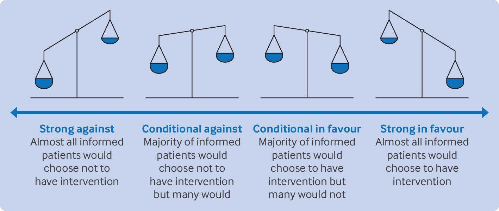
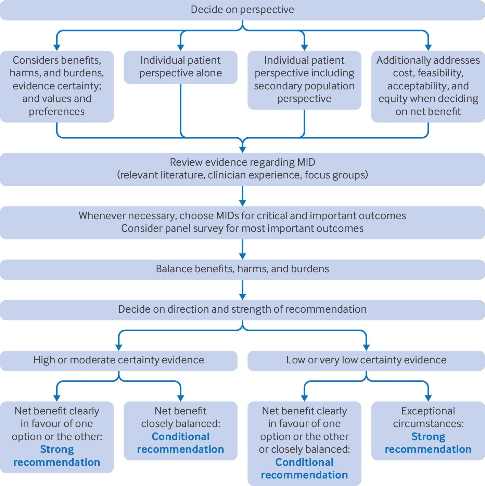
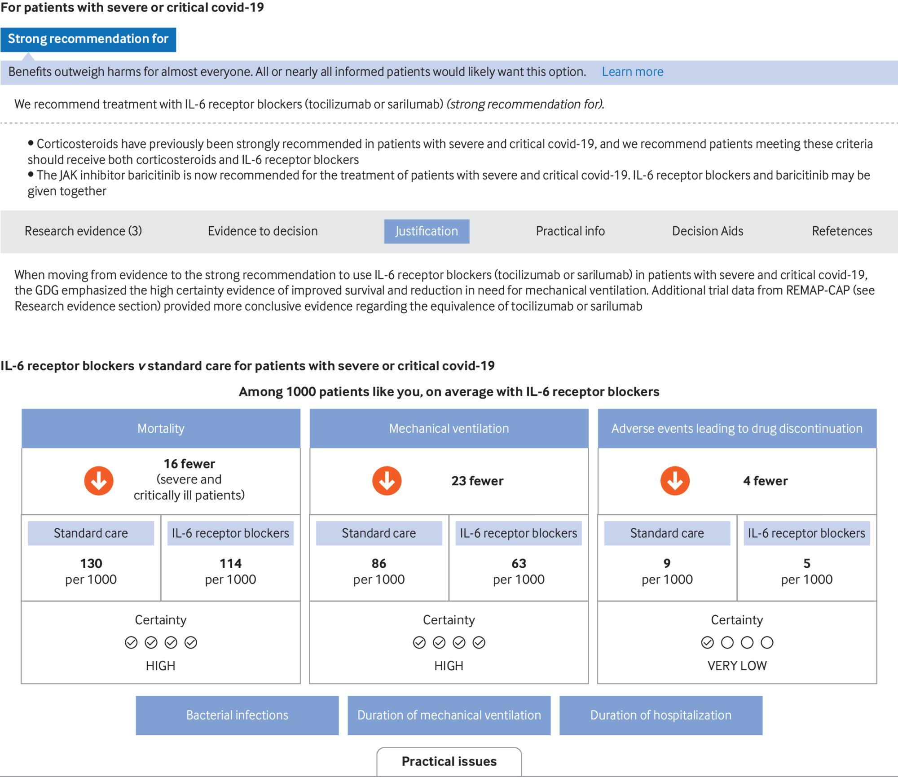
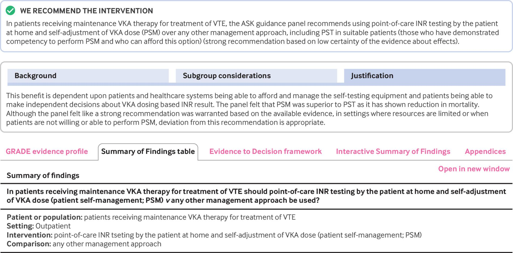
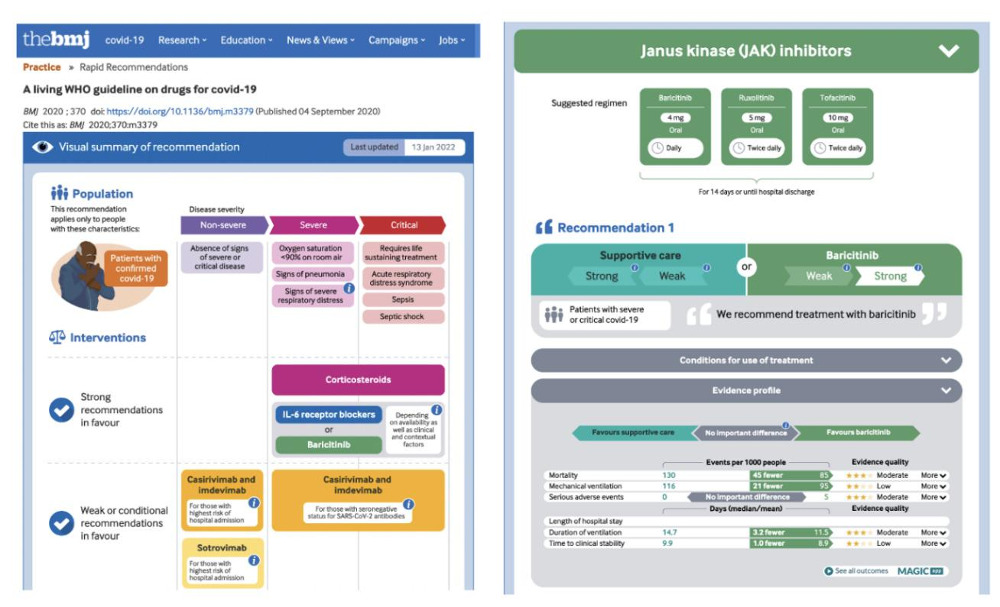

# 12 Moving from evidence to decisions

This last section of our presentation of Core GRADE focuses on the process for moving from evidence to recommendations (most relevant for developers of clinical practice guidelines) or health policy decisions (most relevant for HTA practitioners). Here, we will use the term recommendations, but the key considerations also apply to policy decisions.

Standards for trustworthy guidelines are now globally accepted and underscore the importance of a systematic and transparent process for moving from evidence to recommendations. Adherence to Core GRADE principles greatly facilitates panels in meeting trustworthiness standards.

We will describe here how a guideline panel using the Core GRADE approach decides on the direction and strength of recommendations and the implications of different strengths of recommendations for clinicians—a term we use to include the full range of health professionals delivering clinical care—and patients. In the last section of the paper, we demonstrate presentation formats that let end users easily access the relevant evidence and make optimal use of the guideline document in their clinical practice.

The information in this article will enable Core GRADE users to:

* Understand the principles of moving from evidence to recommendations and decisions within the Core GRADE framework
* Understand the importance of specifying an individual patient and possible secondary population perspective and the implications for decisions
* Differentiate between strong and conditional recommendations and understand the principles for issuing each type of recommendation
* Understand and apply the concept of minimal important difference (MID) in clarifying values and preferences
* Develop clear, structured, and actionable recommendations using standardised GRADE formats

## 12.1 GRADE recommendations

Recommendations made by guideline panels using GRADE are characterised by their direction—for or against an intervention—and their strength—strong or conditional (weak), resulting in four possible categories: strong in favour of an intervention, conditional in favour of an intervention, conditional against an intervention, and strong against an intervention (Fig 4-24). Core GRADE users choose one category for each recommendation.

Sometimes, although potentially unhelpful to the clinician audience and therefore seldom appropriate, Core GRADE users may find the desirable and undesirable consequences of two alternative interventions so closely balanced that they recommend use of either. A final additional rarely used category is a recommendation for limiting an intervention only to the context of research—an issue we return to in the section "Only in research setting recommendations."

 Fig 4-24: The four categories of GRADE recommendations and what they signify in terms of the distributions of preferences in fully informed individuals in target population.

Guideline panels make strong recommendations when they are confident that the desirable consequences of an intervention (eg, decreased mortality and morbidity, improved quality of life) outweigh the undesirable consequences (eg, adverse effects, burden of treatment). The reverse (undesirable outweigh desirable consequences) also dictates a strong recommendation, but against an intervention.

When desirable and undesirable consequences favour the intervention but the magnitude of the difference is smaller, or when considerable uncertainty about their magnitude or importance exists, panels will make conditional recommendations.

Another useful way of thinking about strong and conditional recommendations is to consider a large group of fully informed individuals (that is, they understand the relevant evidence and the ramifications of their decisions) and the choices they would make between an intervention and a comparator. Panels will make strong recommendations when they believe that all, or almost all, fully informed people would choose the recommended course of action. They choose conditional recommendations when they believe that most fully informed individuals would choose the recommended course of action but an appreciable minority would choose the alternative.

Typically, individuals differ in the relative importance they place on benefits, harms, and burdens associated with interventions. We refer to these differing views of importance as peoples' values and preferences. Conditional recommendations signal to clinicians that ensuring a decision consistent with patients' values and preferences will require a process of shared decision making. Conditional recommendations may also reflect population perspectives, such as restricting antibiotic use to avoid the development of resistance.

## 12.2 Determinants of direction and strength of recommendations

To facilitate decisions on the direction and strength of recommendations, GRADE users can refer to GRADE’s evidence to decision frameworks. The frameworks guide users in the key determinants that shape their recommendations. Table 4-8 summarises the primary and secondary issues in GRADE evidence to decision frameworks, and how they influence the strength and direction of recommendations according to the perspective the group takes (see the section “[Perspective](12-12-moving-from-evidence-to-decisions.md#intro-perspective)”).

Table 4-8 | Primary and secondary considerations in Core GRADE's evidence to decision framework that determine direction and strength of recommendations

| Factor                                                                      | Judgments/considerations                                                                                                                                                                                                                                                                                                                                           | Impact on direction and strength of recommendation                                                                                                                                                                                                                                                                                                                                                                                                                                        |
| --------------------------------------------------------------------------- | ------------------------------------------------------------------------------------------------------------------------------------------------------------------------------------------------------------------------------------------------------------------------------------------------------------------------------------------------------------------ | ----------------------------------------------------------------------------------------------------------------------------------------------------------------------------------------------------------------------------------------------------------------------------------------------------------------------------------------------------------------------------------------------------------------------------------------------------------------------------------------- |
| **Primary factors (always considered)**                                     |                                                                                                                                                                                                                                                                                                                                                                    |                                                                                                                                                                                                                                                                                                                                                                                                                                                                                           |
| Benefits, harms, and burdens                                                | 
How large are the benefits? How large are the harms and burdens?
                                                                                                                                                                                                                                                                                         | The larger the benefits the more likely a panel will make a recommendation for an intervention, and the more likely that recommendation will be strong. The larger the harms and burdens the more likely the panel will recommend in favour of the comparator rather than the intervention, and the more likely that recommendation will be strong                                                                                                                                        |
| Certainty of evidence                                                       | What is the certainty of evidence for each of the critical and important outcomes?                                                                                                                                                                                                                                                                                 | The greater the certainty of evidence the more likely a panel will make a strong recommendation. High or moderate certainty evidence often justifies strong recommendations, whereas low and very low certainty mandates, in almost all situations, conditional recommendations                                                                                                                                                                                                           |
| Values and preferences                                                      | 
What are the typical patients' values and preferences? How important do patients judge each benefit and harm outcome and the associated burdens? To what extent do patients vary in their values and preferences? How certain is the panel in its judgment about patients' values and preferences and variability in those values and preferences?
 | The more patients value the benefits the more likely the panel will make a recommendation for an intervention, and the more likely that recommendation will be strong. The more patients value avoiding the harms and burdens the more likely a panel will strongly recommend against an intervention. The less variability in patients' values and preferences and the more certain a panel is about these values and preferences the more likely they will make a strong recommendation |
| **Secondary factors (particularly relevant from a population perspective)** |                                                                                                                                                                                                                                                                                                                                                                    |                                                                                                                                                                                                                                                                                                                                                                                                                                                                                           |
| Resources and cost effectiveness                                            | 
What are the resources required? Would implementing the intervention versus the comparator lead to important costs or savings? How do those costs and savings relate to benefits and harms?
                                                                                                                                                           | The less the costs of an intervention and the greater the savings and cost effectiveness the more likely a panel will make a recommendation in favour of an intervention, and the more likely that recommendation will be strong                                                                                                                                                                                                                                                          |
| Feasibility                                                                 | 
Is it feasible to implement the intervention? What is the relative feasibility of the intervention versus the comparator?
                                                                                                                                                                                                                                | The more feasible an intervention the more likely a panel will make a recommendation in favour of an intervention. Feasibility considerations can also lead to guidance on implementation                                                                                                                                                                                                                                                                                                 |
| Acceptability                                                               | 
Is the intervention acceptable to patients, clinicians, and other key stakeholders? What is the relative acceptability of the intervention versus the comparator?
                                                                                                                                                                                        | The more acceptable an intervention the more likely a panel will make a recommendation in favour of an intervention                                                                                                                                                                                                                                                                                                                                                                       |
| Equity                                                                      | What would be the impact of implementing the intervention versus the comparator on health equity?                                                                                                                                                                                                                                                                  | The more an intervention would increase equity the more likely a panel will make a recommendation in favour of an intervention. Equity considerations can also lead to guidance on implementation                                                                                                                                                                                                                                                                                         |

GRADE=Grading of Recommendations Assessment, Development and Evaluation.

## 12.3 Organization of the guideline process

Ideally, a guideline panel will include a mix of topic or thematic and clinical experts involved in research, clinicians involved primarily in patient care, patients, and methodologists. Optimal guideline function often involves a small steering or oversight group with one or more methodologists and clinical experts. The steering group is responsible for establishing the agenda for each meeting and guiding the panel through the steps of moving from evidence to recommendations.

## 12.4 The process of moving from evidence to recommendations

Fig 4-25 represents the Core GRADE approach for moving from evidence to recommendations.  Fig 4-25: Core GRADE process for moving from evidence to recommendations. MID=minimal important difference

Some GRADE users find it beneficial to use an alternative approach in which they undertake a separate structured review of each evidence to decision factor before integrating it to arrive at their final decisions ([Example of a structured evidence to decision framework](assets/appendix/15.Evidence%20to%20Decision-%20Example%20of%20a%20Structured%20Evidence-to-Decision%20framework.pdf)). Because of its complexity and the large number of decisions involved in its completion, the structured approach represents an option for guideline panels that want to go beyond Core GRADE.

## 12.5 Perspective

Guidelines can consider two perspectives—that of the individual patient and that of a population (also referred to as public health or societal). Core GRADE’s focus is on the individual patient perspective, but Core GRADE recommendations can also include the population perspective as a secondary consideration.

The decision regarding perspective influences how GRADE users approach the evidence to decision framework. Three factors of the framework—the magnitude of benefits, harms, and burdens; the certainty of evidence; and patients’ values and preferences—are key in moving from evidence to recommendations, whatever the perspective. Other factors—costs, cost effectiveness, feasibility, acceptability, and equity—while primarily relevant to the population perspective, may sometimes play a role in the individual perspective.

## 12.6 Choosing the MID for each critical and important outcome: Necessity for choosing the MID

Having considere and rejected outcomes of little importance and classified important outcomes as critical versus important but not critical,1 GRADE users then decide on the MID for each important or critical outcome. This is necessary for two reasons. Firstly, choosing a threshold will make certainty ratings [possible](<assets/appendix/7.Rating down (or not) for imprecision. Challenges and possible solution when one targets the null and the point estimate turns out to be very close to the null.pdf>). To inform recommendations, that threshold must be the MID (the smallest difference in effect that patients would consider important) rather than the null. Thus, decisions on the MID must precede certainty ratings in the evidence synthesis.

Having decided on the MID for each outcome, GRADE users rate certainty in an important effect if the point estimate proves greater than the MID and in an unimportant effect if the point estimate proves less than the MID. The systematic review team then rates certainty in relation to the MID threshold for both [imprecision](<assets/appendix/7.Rating down (or not) for imprecision. Challenges and possible solution when one targets the null and the point estimate turns out to be very close to the null.pdf>) and [inconsistency](12-12-moving-from-evidence-to-decisions.md#intro-applying-visual-criteria-how-choice-of-threshold-affects-judgments-of-inconsistency) domains.

The second reason is that MIDs reflect the relative importance patients place on different outcomes—that is, patients’ values and preferences. For instance, MIDs associated with mortality of 1%, stroke of 2%, myocardial infarction of 3%, and serious gastrointestinal bleeding of 5% reflect the gradient of importance across these outcomes. If the MID associated with mortality is 1%, with stroke is 2%, with myocardial infarction is 3%, and with serious gastrointestinal bleeding is 5%, it tells a great deal about the panel’s inferences regarding the gradient of importance across those outcomes (importance gradient across mortality, stroke, myocardial infarction, and bleeding, mortality five times as important as bleeding).

These value and preference judgments facilitate guideline panels trading off the benefits, harms, and burdens of alternative management strategies. Choosing a single specific MID for a particular outcome may not be required. For instance, consider a treatment associated with a large mortality benefit of 5%. All would agree that this represents an important benefit. Consider further that the boundary of the confidence interval (CI) representing the smallest plausible effect is 3%. This too is clearly an important benefit.

Thus, whether the MID for mortality is 2%, 1%, or less than 1%, the CI does not cross the MID threshold and one will not rate down for imprecision. As a result, one need not specify a single particular value for the mortality MID. In many instances, however, either the point estimate or one boundary of the CI will be in the vicinity of a possible MID, and choosing a specific value of the MID is then necessary. Thus, the process Core GRADE users should follow is to review estimates of effects and 95% CIs, determine if MIDs are necessary, and if necessary, establish MIDs.

Given the frequent necessity for choosing a single specific MID, decision makers face the challenge of how to choose an appropriate MID. In the next section of this article we describe the available approaches.

## 12.7 Evidence that may inform choice of MID

Ideally, for each key outcome, guideline panels would have available a systematic survey of all studies bearing on the MID as well as wider issues of values and preferences. For instance, a BMJ rapid recommendation guideline panel addressing the management of patients with shoulder conditions conducted a systematic survey of MIDs for improvement in patient reported outcomes related to shoulder [conditions](https://doi.org/10.1136/bmjopen-2018-028777) that informed a recommendation for subacromial decompression [surgery](https://doi.org/10.1136/bmj.l294).

However, for most outcomes in most guidelines, little or no useful studies of patients’ values and preferences are available. Use of guideline panels limited time and resources in low yield searches for relevant studies on patients’ preferences is unwise. Core GRADE practice is therefore to consult experts in the specialty and, if the likelihood of finding relevant evidence is very low, to forego the search. We use the same approach for evidence to decision considerations of acceptability, feasibility, and equity in which systematic searches may be even less likely to provide useful information.

In the absence of well done studies ascertaining the values and preferences of large samples of patients, or studies addressing MIDs of specific instruments for measuring health status (patient reported outcome measures), alternatives to infer MIDs are far from ideal. In principle, therefore, guideline panels that fail to identify such studies would launch their own. As guideline panels’ limited resources and time frame make full scale value and preferences studies unfeasible, this is not, however, realistic. An approach that is less satisfactory but still informative and much more feasible is conducting a focus group with a small number of patients. For example, the American College of Rheumatology does this for all its guidelines, and the results have proved useful in informing value and preference decisions for the guideline panels.

The experience of clinicians in conducting shared decision making can also be informative about patients’ values and preferences. For example, a guideline addressed pregnant women at risk of venous thrombosis who were considering anticoagulation with warfarin (low burden treatment) or low molecular weight heparin injections (high burden treatment). Clinicians with considerable experience with such patients had found that women almost invariably chose the injections to avoid the small risk of relatively minor fetal abnormalities that may be associated with warfarin. This information suggests that the MID for fetal abnormalities is very small (mothers will find even a small risk very important) and the MID for the burden of the heparin injections large (mothers will consider a substantial burden of little importance). The approach is unfortunately open to biased inferences and is far inferior to well conducted large patient studies of individual patients’ values. If, however, clinicians are critical in their reflections on their shared decision making experience, the information may be helpful.

Failing these options, Core GRADE users may be able to utilise less structured conversations with their patients, or, for patient partners, with other patients. Whatever the source of evidence on patients’ values and preferences, that evidence requires interpretation to generate a trustworthy MID estimate.

## 12.8 Choosing MIDs

Trying to arrive at a best estimate of the MID through unstructured discussions is challenging, at least in part because most panelists have limited experience with deciding on MIDs. This problem has led to the development of a structured survey approach to help guideline panelists decide on MIDs for their most important [outcomes](https://doi.org/10.1016/j.jclinepi.2023.07.003) (An example of an innovative panel survey approach for eliciting guideline panelists’ views on the minimally important [differences](assets/appendix/12.Evidence%20to%20Decospm-%20An%20example%20of%20an%20innovative%20panel%20survey%20approach%20for%20eliciting%20guideline%20panelists%E2%80%99%20views%20on%20the%20minimally%20important%20difference%20for%20patients.pdf)) (Experience with the panel approach to establishing [MIDs](assets/appendix/13.Evidence%20to%20decision-%20Experience%20with%20the%20panel%20survey%20approach%20to%20establishing%20MIDs.pdf)). The approach relies on offering panelists extremely low and high MIDs, gathering their associated choices, and then moving in both directions towards more likely estimates. The candidate MID is the value at which half the panel believes the majority of patients would consider the magnitude of effect unimportant and the other half believes the majority would consider the magnitude important. The guideline steering group explains the survey to panelists, drafts the survey, administers the survey to the panel, and presents and provides an interpretation of the results.

Reflecting differences in the values and preference of their target populations, including the socioeconomic and cultural environment in which they function, panelists may choose quite different MIDs for the same outcome. Explicit reporting of MIDs, and value and preference statements, allows users to understand the determinants of recommendations and how they might change with alternative values and preferences.

Moving beyond MIDs to other issues in elucidating panels’ views on patients’ values and preferences, the survey approach also provides a method to examine the minimal benefit patients would require, given the existing harms and burdens, to use an intervention. A panel used the approach when evaluating the smallest reduction in end stage renal disease patients would require to choose plasma exchange given its 6% increase in serious infections.22 Finally, surveys can present panelists with a summary of the benefits, harms, and burdens and obtain their views on the distribution of choices—from all who would choose to receive to all who would choose to decline—in the relevant population. A panel conducted such a survey to help inform the recommendation for sodium-glucose cotransporter-2 inhibitors in patients at varying risk of adverse vascular [outcomes](https://doi.org/10.1136/bmj.n1091).

## 12.9 Balancing benefits, harms, and burdens

In the next step in making recommendations, the guideline steering group and panel review the summary of findings table and judge the trade-off between benefits on the one hand and harms and burdens on the other. This decision will be informed by the inferred values and preferences of patients that the panel must make clear through an appropriate statement. Such value and preference statements capture the key considerations in trading off desirable and undesirable consequences of the intervention and comparator. This statement will be highly contextual. For instance, when only low certainty evidence is available—as was the case early in the covid-19 pandemic—the trade-off requires statements of the relative value of uncertain benefit versus, usually, more certain harms and burdens.

Guideline panelists may have limited experience in constructing value and preference statements, and the panel steering group, guided by the participating methodologists, can present them with a suggestion. Box 1 provides examples of guideline value and preference statements from several organisations, including the World Health Organization (WHO) covid-19 guidelines and a BMJ Rapid recommendation. As presented in the first example, we have found it valuable to present options of opposite values and preferences from which the panel can choose—the choice will likely determine the direction of the [recommendation](https://doi.org/10.1136/bmj.m2980).

**Box 1: Examples of guideline value and preference statements**

**Example 1: WHO guideline on clinical management of covid-19**

* The WHO guideline on clinical management of covid-19 includes one recommendation for awake prone positioning. The evidence indicated a small reduction in the need for mechanical ventilation with no other important benefits. The panel considered alternatives based on its judgments about patients' values and preferences (see below) and ultimately selected the first option during the recommendation process.
  * Option 1: "The panel placed a relatively high value on a modest reduction in invasive mechanical ventilation and a lower value on the discomfort patients experience using awake prone positioning."
  * Option 2: "The panel placed a relatively low value on a modest reduction in invasive mechanical ventilation and a higher value on the discomfort patients experience using awake prone positioning."

**Example 2: Living WHO guideline on drugs for covid-19**

* During the early phase of the covid-19 pandemic, the panel producing WHO rapid recommendations on drugs for covid-19 considered the following patients' values and preferences when issuing recommendations:
  * "The Guideline Development Group agreed that the following values and preferences would be representative of those of typical well-informed patients:
  * Most patients would be reluctant to use a treatment for which the evidence left high uncertainty regarding effects on the outcomes they consider important. This was particularly so when evidence suggested treatment effects, if they exist, are small and the possibility of important harm remains.
  * In an alternative situation with larger benefits and less uncertainty regarding both benefits and harms, more patients would be inclined to choose the treatment."

WHO=World Health Organization.

In the two examples, the values and preferences selected interacted with benefits and harms and the certainty of evidence to inform the panel’s decisions. In the first instance regarding awake prone positioning for ventilation in seriously ill patients with covid-19, the point estimate suggested a 1.2% reduction in mortality, but the CI included a 1.5% increase. The evidence for hospital length of stay was equally unconvincing. Results showed moderate certainty evidence supporting a 4.1% decrease in endotracheal intubation.

The panel was then left to trade off this relatively small benefit against patient discomfort and nursing burden. The value and preference judgment that the small reduction in ventilation carried a higher value than discomfort and burden determined the recommendation in favour of awake prone positioning. However, the panel believed the balance between desirable and undesirable consequences was a close one, that an appreciable minority of fully informed patients (those who poorly tolerate awake prone positioning) would decline the intervention, and thus decided on a conditional recommendation.

In the second example, early in the pandemic, clinicians were considering repurposed drugs or newly tested agents with only low or very low certainty evidence of benefit in patients with severe or critical covid-19. As is often the case when only low certainty evidence is available, decisions were very highly value and preference sensitive. The WHO guideline panel recognised that some patients, given the severity of their illness, would be ready to try agents with only scant evidence of benefit.

Others would be reluctant to subject themselves to the adverse effects of such agents. Aware of these varying values, the panelists consistently made conditional recommendations. Their value and preference judgments, captured in their statement, drove the direction of their conditional recommendation against several drugs. When higher certainty evidence becomes available, the trade-off typically becomes clearer. For instance, a practice guideline addressing antithrombotic treatment required trading off thrombotic versus bleeding outcomes when in many instances high or at least moderate certainty evidence was [available](https://doi.org/10.1378/chest.11-2286).

The trade-off may involve both individual patient and population issues and, when it does, the secondary issues of cost, feasibility, acceptability, and equity become important (fig 2).

For example, a guideline related to transfusion thresholds required consideration of both mortality (the key outcome from the individual patient perspective) and conservation of the blood supply (the key outcome from the population perspective).27 Considering conservation of blood supply contributed to the panelists’ decision to make a strong recommendation in favour of a lower transfusion threshold.

## 12.10 Constructing the recommendations

The examples above show how those producing recommendations must first decide on their direction and subsequently address their strength as strong or conditional. Panelists make strong recommendations when they are confident that benefits of an intervention or comparator clearly outweigh the harms and burdens of the alternative, and they make conditional recommendations when the net benefit is less clear (Table 4-8). We have found a useful way to conceptualise the distinction between the two situations. When panelists believe that all or almost all fully informed individuals would choose a particular option, they make a strong recommendation. When panelists believe that an appreciable minority, because of differing values and preferences, would choose the option not recommended, they make a conditional recommendation. We have illustrated this logic in two of the previous examples.

When certainty is low or very low for either benefits or harms and burdens it is almost always impossible to have the level of certainty required for a strong recommendation. As a result, Core GRADE users should generally avoid making strong recommendations in the presence of low certainty evidence for key outcomes. They may, however, consider a strong recommendation for an intervention when the certainty of evidence for benefit is low and the likelihood of a bad outcome of great importance (eg, death, stroke) is very high. They may make a strong recommendation against an intervention when there is low certainty of evidence for benefit and high or moderate certainty for substantial harm ([Examples of appropriate strong recommendations based on low certainty evidence](<assets/appendix/14.Evudebce ti decision- Examples of appropriate strong recommendations based on low certainty evidence[1].pdf>)).

## 12.11 Only in research setting recommendations

Panels may sometimes make recommendations for use of an intervention only in research. Such a recommendation would be an alternative when panels consider the generation of higher evidence an important priority. For example, early in the covid-19 pandemic WHO recommended use of ivermectin in research settings only.

## 12.12 Additional examples of moving from evidence to recommendations: Individual patient perspective

For many recommendations, particularly those involving simple, highly accessible, and generally affordable pharmaceutical interventions, GRADE users will solely or primarily consider the patient perspective. The panelists in these situations focus evidence to decision considerations on benefit, harm, burden, evidence certainty, and values and preferences, and they only briefly consider cost, feasibility, acceptability and equity—long enough to confirm that such factors will not have a substantial influence on the recommendations.

For example, WHO’s living guidelines for the treatment of people with covid-19 considered a recommendation of corticosteroids for those with severe or critical disease. The relevant systematic review reported a probable 3.4% absolute reduction in mortality—an order of magnitude far greater than WHO’s MID of 3 per 1000—as well as substantial reduction in need for mechanical ventilation. Moreover, the review reported convincing adverse effects only in the relatively unimportant outcomes of hyperglycaemia and hypernatraemia. Given the low cost and wide availability of the intervention, the panel judged secondary evidence to decision considerations of little relevance. Reasoning that all or almost all people with severe or critical covid-19 would choose to receive corticosteroids, the panel issued a strong recommendation in favour of these drugs.

In another example, two allergy organisations addressed whether topical treatments for uncontrolled atopic dermatitis should be applied once or twice daily. The network meta-analysis that informed the recommendations showed a small improvement with twice versus once daily application (risk difference of 5% for improved eczema compared with the MID threshold of 3%) and similar small improvements in itch, quality of life, and sleep disturbance. Harms proved no different between groups, with burdens anticipated to be lower in the once daily group. To decide whether patients would consider the small benefits worth the burden of a second application, the panel conducted a systematic review of patients’ values and preferences and discovered that they place a high value on minimising the burden associated with application of topical treatments. This led the panel to make a conditional recommendation for once daily application. Given the modest cost considerations, the absence of feasibility issues, and the lack of impact on equity from the individual patient perspective, only primary considerations proved relevant to the recommendation.

## 12.13 Population perspective and secondary evidence to decision considerations

When guideline panels take a population perspective into consideration, secondary evidence to decision considerations will almost always arise. For instance, making a recommendation about the use of remdesivir in people with non-severe covid-19 at high risk of hospital admission, given a probable important reduction in the key outcome of hospital admission and no compelling evidence of serious adverse effects, a WHO guideline panel made a recommendation in favour of the drug. Given the moderate certainty of evidence on the critical outcomes of benefit, the recommendation might have been strong were it not for the requirement for a three day course of intravenous treatment.

For the patient, one could consider the necessity to come to a facility for the injection on three consecutive days as a burden, a practical issue, or an issue of acceptability. However one chooses to look at it, the requirement is likely to dissuade some people from using remdesivir. Moreover, the complexity of establishing or mobilising outpatient facilities for using intravenous treatment involves challenges and cost. Finally, the panel noted that differential access to remdesivir could exacerbate health inequities. The feasibility, acceptability, cost, and equity concerns led the panel to issue a conditional rather than a strong recommendation for use of the drug.

An AABB guideline panel considering a restrictive (7 g/dL) versus a liberal (9-10 g/dL) transfusion strategy in patients with anaemia admitted to hospital made a strong recommendation in favour of the restrictive strategy. For patients, fewer blood transfusions and thus reduced likelihood of a blood transfusion represented a benefit of the restrictive strategy. The supporting systematic review also reported a point estimate of no difference in mortality between the two strategies. However, the CI that included an important 1.3% increase in mortality with the restrictive strategy might have led some very risk averse patients to choose the liberal strategy and thus have prompted a conditional recommendation. While the panelists’ primary focus was the individual patient, they also considered the population perspective, particularly stewardship of blood supply. Their concern about optimising the use of this scarce resource contributed to the decision to issue a strong recommendation.

## 12.14 Optimized presentation of recommendations

When presenting recommendations, GRADE users must ensure that their suggestions are clear and actionable and that they contain explicit information about the population, intervention, and most often also the comparison. GRADE offers specific language for strong (we recommend) and conditional (we suggest) recommendations. Guideline authors may provide explicit direction for, in the presence of conditional recommendations, engaging in shared decision making. They should avoid wording associated with ambiguity, such as recommendations “to consider” an intervention.

GRADE users should present recommendations along with their strength and, optionally, with the associated certainty of the evidence. Box 2 provides examples of recommendation framing. Fig 4-26 and Fig 4-27 show alternative approaches of how recommendations can be phrased, including provision of succinct accompanying remarks when required.

**Box 2: Examples of presenting recommendations**

**Example 1:** "In patients with uncontrolled atopic dermatitis refractory to moisturization alone, the \[Joint Task Force] panel recommends addition of a topical corticosteroid over no topical corticosteroid (strong recommendation, high certainty evidence)"

**Example 2:** "For older adults with newly diagnosed \[acute myeloid leukemia] considered candidates for intensive antileukemic therapy, the \[American Society of Hematology] guideline panel suggests intensive antileukemic therapy over less intensive antileukemic therapy (conditional recommendation based on low certainty in the evidence of effects)"

**Example 3:** "Recommendation 2: In patients with atopic dermatitis, the Joint Task Force panel suggests using a standard, bland (free of fragrance and other potential contact allergens) over-the-counter moisturizer over a prescription moisturizer medical device (eg, Atopiclair, Eletone, Epiceram, MimyX, Neosalus, Zenieva, and PruMyx) (conditional recommendation, low-certainty evidence)"

 Fig 4-26: (Top panel) Recommendation with remarks and tabs so users can find all pertinent information, here shown first paragraph of a detailed justification for moving from evidence to a strong recommendation. (Bottom panel) Decision aid with outcomes and practical issues that matter to patients  Fig 4-27: Strong recommendation for point of care INR testing, followed by justification, GRADE summary of findings table, and evidence to decision framework in deeper layers. INR=international normalised ratio

In general, it is preferable to present recommen-dations in favour of a particular management approach (including the comparator in the initial framing of the population, intervention, comparison, and outcome) rather than against an approach (typically the intervention). Considering the management of atopic dermatitis (eczema), a joint task force of two allergy societies compared prescription moisturisers (initially the intervention) with comparator over-the-counter moisturisers and found their effects to be similar. The panelists believed that the burdens and acceptability of the prescription moisturisers warranted use of the over-the-counter preparation, but instead of recommending against the prescription, they stated, “In patients with atopic dermatitis, the Joint Task Force panel suggests using a standard, bland over-the-counter moisturizer over a prescription moisturizer medical device.”

Situations do, however, arise when an ineffective or harmful treatment is in wide use and a recommendation against that treatment is appropriate. For instance, the same guideline panel on atopic dermatitis addressed dilute bleach baths for treatment. Its systematic review and meta-analysis showed that the intervention was effective in those with moderate-severe disease but likely provided little to no benefit in those with mild disease.34 The intervention is burdensome and associated with adverse effects, albeit usually mild. The panelists believed that the key message was, rather than to use the alternative, to avoid dilute bleach baths in those with mild disease, and so recommended against the intervention.

## 12.15 Enhancing dissemination of guidelines

GRADE aims to make it easier for clinicians and their patients to make well informed decisions in practice, using guidelines as tools for decision support. User testing of GRADE based guidelines underscores the need for optimised presentation and dissemination of guidelines, summary of findings tables, and decision aids, in multilayered formats. Fig 4-28 shows the living WHO guideline on drugs for covid-19. Available online as open access, it shows how interactive infographics can provide an overview of recommendations, with supporting GRADE summary of findings tables, practical considerations, and succinct narrative presentations of evidence to decision issues (refer to user testing infographics).

 Fig 4-28: (Left panel) Guideline applying Core GRADE, showing infographic with strong and conditional recommendations for treatments (Right panel) Interactive summary of findings table and other key issues one click away.

Fig 4-26 and Fig 4-27 also show how users can access the full guideline with all relevant information (eg, justification, practical issues) in multilayered formats available online on all devices. For the WHO living guideline, this includes tools for shared decision making, created from GRADE summary of findings tables and adding practical issues (bottom panel in Fig 4-26). This guideline also illustrates an additional challenge of living evidence: dynamic updates of recommendations warrants communicating what is new.

Ceation of digitally structured guideline content in online platforms, rather than PDF documents, facilitates publication of multilayered guideline formats. To further enhance dissemination, guideline groups can create digitally structured recommendations through websites, pathways, flowcharts, and local protocols as well as decision support systems linked to patient data in the electronic health records. These advances facilitate unhindered access to recommendations at the point of care. A major challenge, in particular for GRADE teams working in resource constrained settings, is the costs of using available online platforms for authoring and publication.

## 12.16 Conclusion

Core GRADE provides a clear, practical path from evidence to recommendations and decisions (Fig 4-24). The approach emphasises the necessity to specify the perspective (always the individual patient, sometimes secondarily the population), establish MIDs for key outcomes, and make explicit the underlying values and preferences. The approach highlights the key role of certainty of evidence in determining whether a recommendation is strong or conditional, and clarifies primary and secondary considerations in moving from evidence to recommendations.
